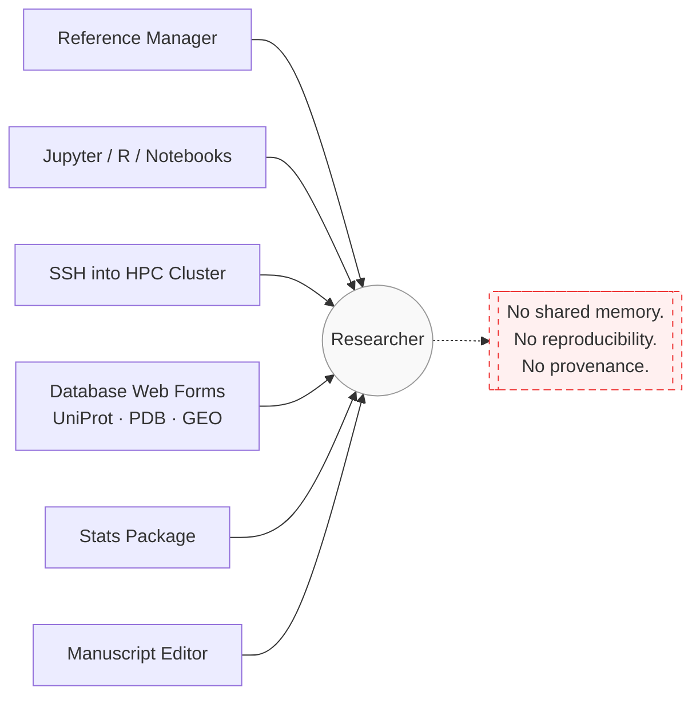
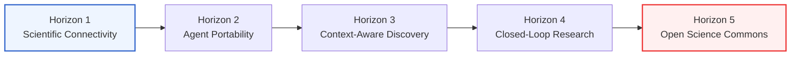
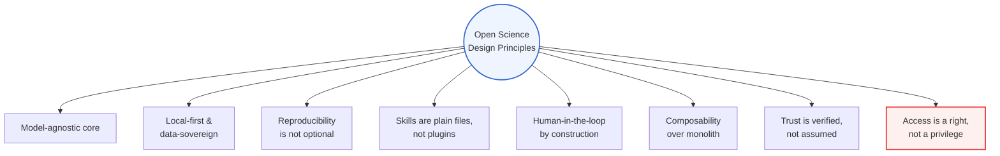
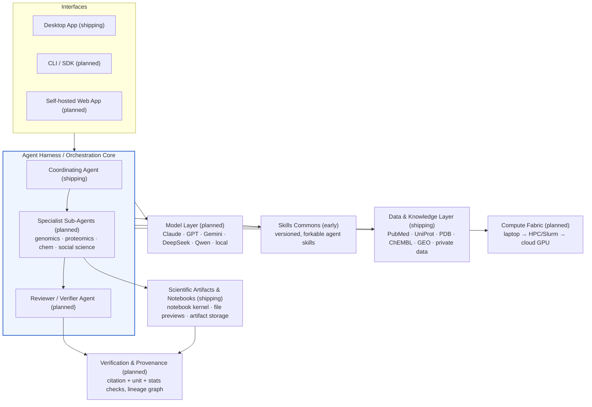
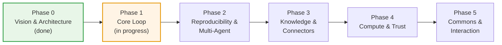
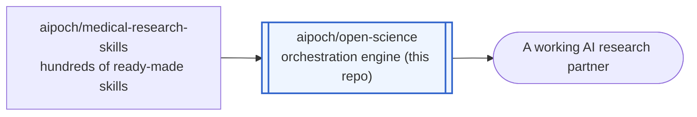

# Open Science

**An open-source, model-agnostic AI workbench for scientific discovery.**

[](https://github.com/aipoch/open-science/releases/latest)
[](LICENSE)

[](https://github.com/aipoch/open-science/discussions)
[](https://x.com/aipoch_ai)
[](https://discord.gg/85dKfuGM9)

> ### 🔓 Science is not a privilege.
>
> It shouldn't require a subscription tier, a supported billing region, or one company's approval to put AI to work on real research. Peer review doesn't check your credit card. A hypothesis doesn't care what currency your lab is funded in. Knowledge has always advanced by being shared, checked, and rebuilt in the open — the tools that now sit at the center of that process are the last thing that should be locked behind a paywall. **That belief is the entire reason this project exists**, and it's non-negotiable as the project grows.

**📣 We're building this in public.** Follow the architecture take shape and join the debates as they happen — 🐦 **[@aipoch_ai on X](https://x.com/aipoch_ai)** and 💬 **[our Discord](https://discord.gg/85dKfuGM9)** are where it's actually discussed, before it ever lands in a doc like this one.

> This is an early-preview, actively-developed project. The core "plan → execute → produce → preview" loop works end to end today (desktop app, agent runtime, notebook execution, artifact storage, in-app previews) — see [Current Status](#current-status) for exactly what's implemented versus still ahead. If you want a finished product, this isn't there yet; if you want to build the open alternative to a closed-source category from the ground floor, keep reading.

---

## Table of Contents

- [Quick Start](#quick-start)
- [Why](#why)
- [Open Science vs. Claude Science](#open-science-vs-claude-science)
- [Vision](#vision)
- [Design Principles](#design-principles)
- [What We're Building](#what-were-building)
- [Current Status](#current-status)
- [Development & Packaging](#development--packaging)
- [Building From Source (macOS Gatekeeper Note)](#building-from-source-macos-gatekeeper-note)
- [Roadmap](#roadmap)
- [Relationship to the aipoch Ecosystem](#relationship-to-the-aipoch-ecosystem)
- [What This Is Not](#what-this-is-not)
- [Get Involved](#get-involved)
- [License](#license)
- [Star History](#star-history)

---

## Quick Start

Three ways to get the app running — pick whichever matches how you work.

### Option 1 — Download a prebuilt app (no toolchain required)

The fastest path if you just want to use it — no Node, no Git, nothing to build. Three steps:

1. Open the **[Releases page](https://github.com/aipoch/open-science/releases/latest)** (or click the green **Download the App** button at the top of this page).
2. Under the latest release, expand **▸ Assets** and download the file that matches your computer:

   | Your computer | File to download |
   | --- | --- |
   | Mac with Apple Silicon (M1–M4) | `open-science-<version>-mac-arm64.dmg` |
   | Mac with Intel chip | `open-science-<version>-mac-x64.dmg` |
   | Windows | `open-science-<version>-win-x64-setup.exe` |
   | Linux | `open-science-<version>-linux-x86_64.AppImage` or `open-science_<version>_amd64.deb` |

   > Not sure which Mac you have? Open the Apple menu (top-left) → **About This Mac**. A "Chip" line reading "Apple M1/M2/M3/M4…" means Apple Silicon; "Intel" means Intel.

3. Open the downloaded file and install it like any other app.

> Security-conscious? Each release ships a `SHA256SUMS.txt` and a signed build-provenance attestation, so you can confirm a download is intact **and** was built by this repo's CI. See [Verifying your download](SECURITY.md#verifying-your-download).

Official macOS release downloads are now **Developer ID signed and notarized by Apple**, so they open like any other app — no Gatekeeper bypass needed. Windows builds aren't signed with a paid certificate yet, so Windows shows a bypassable "unknown publisher" prompt on first launch — this is expected, not a corrupted download (**More info → Run anyway**). A self-built or nightly `.app` isn't notarized; see the [macOS Gatekeeper note](#building-from-source-macos-gatekeeper-note) for the one-time steps to open those. Want the bleeding edge instead? The **Nightly (latest main)** pre-release tracks the newest commits.

Once installed, the app keeps itself up to date: on macOS, Windows, and Linux it checks for new stable releases and applies them **in place** in the background, so you don't have to re-download and re-install for each version.

> To run agent sessions, the app uses your existing Claude Code login (reused automatically if you have one) or a custom model gateway you set up in-app — it manages this auth in its own config dir and ignores `ANTHROPIC_*` variables from your shell.

### Option 2 — Hand it to an AI agent

If you use a coding agent (Claude Code, Codex, WorkBuddy, Cursor, …), one sentence is enough — the agent will clone, install, and launch it on its own:

> Clone https://github.com/aipoch/open-science.git, install its dependencies, and run it in development mode.

That's genuinely all the context an agent needs today: it's a standard Electron + npm project, `npm install` handles every setup step (Prisma client generation, native Electron dependencies) automatically via `postinstall`, and `npm run dev` opens the desktop window.

### Option 3 — Run from source

Prerequisites: [Node.js](https://nodejs.org/) (LTS or newer) with npm, and Git. Optional: `python3` on your `PATH` if you want the built-in notebook kernel to execute code.

```bash
# 1. Get the code
git clone https://github.com/aipoch/open-science.git
cd open-science

# 2. Install dependencies
#    (postinstall auto-runs `prisma generate` + `electron-builder install-app-deps` — no extra steps)
npm install

# 3. Run the app in development mode
npm run dev
```

`npm run dev` builds the Electron main/preload bundles, starts the renderer dev server on `localhost:5173`, and opens the **Open Science** desktop window automatically. Development data is isolated under `~/.open-science-project`, so it never touches a production install's data.

> **Tip:** on a cold first launch the window occasionally fails to appear even though the process is running — just `Ctrl+C` and run `npm run dev` again.

To run agent sessions inside the app, sign in with your Claude Code login (reused automatically if you already have one) or configure a custom model gateway in the app's settings; the app keeps this auth in its own config dir rather than reading `ANTHROPIC_*` variables from your shell. To package an installable app instead of running from source, see [Development & Packaging](#development--packaging).


## Why

A working scientist's day is a tour of a dozen disconnected tools: a reference manager, a Jupyter kernel, an SSH session into a cluster, six browser tabs of database web forms (UniProt, PDB, GEO, ClinVar...), a stats package, and a manuscript editor that knows nothing about any of the above. None of these tools talk to each other. None of them remember what you did yesterday. Reproducing your own analysis from three months ago is often harder than doing it the first time.



The clearest current articulation of what an AI-native answer to this looks like is a coordinating agent with specialist sub-agents for genomics, proteomics, structural biology and cheminformatics; native rendering of scientific artifacts; a reviewer agent that checks citations and calculations; and direct integration with the databases and compute scientists already use. That's a genuinely good sketch of the destination — and it's exactly the category of product the best closed-source AI research workbenches on the market today have already demonstrated.

But that category, as it exists today, is also **closed source** — gated behind a single vendor's subscription, one model family, one company's infrastructure, one roadmap, one pricing policy, one data-handling agreement. A university lab in a country without billing access, a hospital that legally cannot send patient data to a third-party API, an independent researcher who wants to run everything on a local GPU box, or a team that simply wants to read the code that touches their data — none of them have a seat at that table. You cannot audit what you cannot read, and you cannot fork what was never released.

Science has never worked that way. It advances through open publication, peer review, replication, and the free movement of method and result across borders and budgets — a system built, imperfectly but deliberately, to resist gatekeeping. **Science is not a privilege reserved for whoever can afford the right subscription plan or happens to live in a supported billing region — it is a public good, and the tools that now sit at its center should be held to the same standard the rest of science already is.** A closed-source AI workbench for research recreates exactly the kind of walled garden that scientific norms exist to tear down, no matter how good the product behind the wall is.

We think the software layer that increasingly mediates how science gets done should be inspectable, forkable, and free of a single corporate gatekeeper — the same argument that got Linux under every cloud and JupyterHub under every university. Open Science is an attempt to build that layer from first principles: not a proxy or a jailbreak of someone else's product (see [What This Is Not](#what-this-is-not)), but an independent, open implementation of the same category of tool — open source, because science itself is supposed to be.

> Debating whether this problem framing is even right? That's a Discord conversation, not a GitHub Issue — **[come argue with us](https://discord.gg/85dKfuGM9)**.

## Open Science vs. Claude Science

We keep referencing Claude Science throughout this document because it deserves the credit: it's the best current articulation of "an AI workbench for scientists," and a lot of the architecture below — the coordinator + specialist-agent pattern, a dedicated reviewer agent, artifacts with full reproducibility — is us saluting a good design and asking "what would this look like if it were open?"

So let's be direct about where each project actually stands, instead of hand-waving it:

|                                   | Claude Science                                                            | Open Science                                                                                                                                                            |
| --------------------------------- | ------------------------------------------------------------------------- | ----------------------------------------------------------------------------------------------------------------------------------------------------------------------- |
| **Source**                        | Closed source                                                             | Open source, Apache-2.0                                                                                                                                                 |
| **Model**                         | Claude models only                                                        | Model-agnostic — Claude, GPT, Gemini, DeepSeek, Qwen, or a local open-weight model                                                                                      |
| **Deployment**                    | Anthropic-hosted cloud                                                    | Self-hosted by default; your infrastructure, your data doesn't have to leave it                                                                                         |
| **Pricing**                       | Seat-based subscription (Claude Pro/Max/Team/Enterprise)                  | Free and open; you pay only for the compute/model calls you choose to make                                                                                              |
| **Availability**                  | Gated by Anthropic billing region and plan tier                           | Runs anywhere you can run the software                                                                                                                                  |
| **Skills**                        | ~60 curated skills, Anthropic-maintained                                  | Open skills commons — community-contributed, versioned in git, forkable (seeded by [aipoch/medical-research-skills](https://github.com/aipoch/medical-research-skills)) |
| **Domain scope today**            | Life sciences (genomics, proteomics, structural biology, cheminformatics) | Life sciences, plus social science and economics from day one (planned)                                                                                                 |
| **Compute**                       | SSH/HPC access plus Modal for on-demand GPUs                              | Pluggable compute fabric — any HPC scheduler, any cloud GPU provider (planned)                                                                                          |
| **Reviewer / verification agent** | Yes, shipping today                                                       | Yes, planned as an open, inspectable layer ([Phase 4](#roadmap))                                                                                                        |
| **Customization**                 | Configure agents inside Anthropic's product surface                       | Every layer — gateway, skill runtime, compute broker, reviewer — is inspectable and replaceable                                                                         |
| **Maturity**                      | A shipping, polished product, in use today                                | Early preview: working core loop with downloadable desktop builds, plus first-cut agent skills and life-science / MCP data connectors; the deeper differentiating layers are still ahead (see [Roadmap](#roadmap))                                                                                                      |

The Maturity row matters most, so we won't bury it: if you need a working AI research assistant today, Claude Science is the more capable choice. Open Science's advantage isn't feature parity yet — it's the structural ceiling underneath.

But look again at the Source and Availability rows, because those are the ones we actually care about. Nothing about Claude Science's design requires it to be closed, single-vendor, or subscription-gated; those are business-model choices layered on top of a good architecture, and they're the choices we reject on principle. Closed source turns a research tool into a rented privilege — usable only by whoever holds an active subscription in a supported billing region, inspectable by no one outside the company that built it. That's a normal thing to accept from a consumer product. It's not a normal thing to accept from infrastructure for science, a field whose entire method depends on being able to see how a result was produced. Open Science exists to remove that layer, so the same category of tool can run on a lab's own terms — any model, any infrastructure, any budget, fully auditable, owned by no one but the researcher running it. We'd rather ship a slower, honest path to that than fake a finished product.

## Vision

Our long-run bet: **the AI research assistant becomes infrastructure, not a product.** In the world we're building toward —

- A PhD student with a laptop and an OpenRouter key, a national lab with an air-gapped GPU cluster, and a biotech with an enterprise model contract are all running the _same_ open orchestration core — they've just pointed it at different models and compute.
- Domain expertise compounds in public. A protocol-design skill written by a genomics lab in Shanghai and a statistics-review skill written by a methodologist in Boston both live in the open skills commons, get used by thousands of other labs, and get better through real usage instead of being reinvented behind each institution's firewall.
- Reproducibility stops being a virtue people feel guilty about skipping. Every figure, every number in a manuscript, carries its lineage — the exact code, environment, and data version that produced it — because the tooling makes that the default output, not extra work.
- No researcher is locked out of AI-augmented science by the country they live in, the model vendor their institution can legally contract with, or their ability to pay a per-seat SaaS fee.

None of this is a technical constraint we're working around — it's the point. Every design decision in this project is downstream of one belief: **science is not a privilege, and the tools built for it shouldn't behave like one.**

We're not trying to out-feature any single closed-source competitor. We're trying to make sure this product category has an open, self-hostable, vendor-neutral implementation — the way Postgres exists alongside proprietary databases, and Linux exists alongside proprietary operating systems.

### The Long Arc: Five Horizons

The [Roadmap](#roadmap) below is our concrete, near-term delivery plan. Underneath it sits a longer arc describing what "done" looks like for AI-native science as a field — not just for this codebase — walking from wiring up scientific data and tools as agent-callable capabilities, through making that capability portable across models and frameworks, to a fully open commons where protocols, agents, and workflows compose across labs, models, and platforms:



Full descriptions of each horizon — and where the current codebase actually sits on this arc — live in [`ROADMAP.md`](ROADMAP.md#long-term-vision-five-horizons).

## Design Principles

These are the constraints we won't trade away as the project grows:



- **Access is a right, not a privilege.** No plan tier, no billing-region allowlist, no corporate approval queue stands between a researcher and the software. If you can run it, you can use all of it — this is the principle every other one on this list exists to protect.
- **Model-agnostic core.** The orchestrator is designed to talk to LLMs through a pluggable gateway. Claude, GPT, Gemini, DeepSeek, Qwen, or a locally-hosted open-weight model behind vLLM/Ollama should all be first-class citizens — including using different models for different agents based on cost and capability. (This is a design target; see [Current Status](#current-status) for what's actually wired up today.)
- **Local-first, data-sovereign by default.** Self-hosting is the default deployment target, not an enterprise upsell. Your data, your compute, your keys, unless you explicitly choose a hosted path.
- **Reproducibility is not optional.** Every artifact — figure, table, claim — should ship with the code, environment, and data lineage that produced it. This is meant to be a property of the system, not a discipline we hope researchers maintain by hand.
- **Skills are plain files, not plugins.** A skill should be versioned, human-readable, and forkable (markdown + code, in the spirit of [aipoch/medical-research-skills](https://github.com/aipoch/medical-research-skills)) — auditable by the researcher who's trusting it with their analysis, not a binary blob from a marketplace.
- **Human-in-the-loop by construction.** New data sources, new compute budgets, and new external credentials require explicit approval. Autonomy is meant to be opt-in and scoped, never ambient — today that's a tool-call approval gate with per-conversation approval profiles (grants remembered by tool category); finer per-scope tiers (single-use / session / project / global) are planned.
- **Composability over monolith.** The target architecture is small, swappable services (model gateway, skill runtime, compute broker, artifact renderer) instead of one inseparable black box, so labs can replace the parts they don't trust or don't need. Most of these services don't exist as separable pieces yet — see [Current Status](#current-status).
- **Trust is verified, not assumed.** A reviewer/verifier agent should eventually check citations, units, and statistical methods before output ships, with its checks themselves inspectable.

## What We're Building

Open Science is organized around cooperating layers — the same category of capability a coordinator-plus-specialists AI research workbench demonstrates, decomposed into open, independently replaceable pieces instead of one closed product surface:



- **Agent Harness / Orchestration Core.** A coordinating agent that plans multi-step research tasks and executes tool calls, with typed activity visualization and a permission gate for higher-risk actions. _Shipping today_ via an Agent Client Protocol (ACP) runtime. Specialist sub-agents (genomics, proteomics, structural biology, cheminformatics, and — unlike most current tools in this space — non-life-science domains like social science and economics) and a dedicated reviewer agent are planned.
- **Model Layer.** A unified gateway in front of any LLM provider or self-hosted model, with per-agent routing — a cheap fast model for grunt-work sub-tasks, a frontier model for synthesis and writing, a local model for anything that can't leave the building. _Planned_ — today's runtime is wired to a single agent backend.
- **Skills Commons.** An open, versioned registry of agent skills — protocol design, statistical review, literature synthesis, figure generation, and domain-specific analysis pipelines — designed to interoperate with [aipoch/medical-research-skills](https://github.com/aipoch/medical-research-skills) as its first and largest skill pack. _Early:_ file-based skill management ships today — create, edit, and import (zip) skills and pull them into a session through a `/` selector — but the open, shareable public commons is still planned.
- **Data & Knowledge Layer.** Connectors to the open scientific commons — PubMed/PMC, UniProt, PDB, Ensembl, Reactome, ClinVar, ChEMBL, GEO, arXiv/bioRxiv/medRxiv, OpenAlex — plus custom MCP servers for institutional and proprietary datasets that never leave the researcher's access boundary. _Shipping today_: 24 built-in connectors — 23 life-science data connectors expanded and aligned to their upstream MCP servers into 200+ callable tools, plus an offline OpenChemLib molecule viewer — plus custom MCP server support (stdio/HTTP/SSE), all callable from agent sessions behind the permission gate.
- **Compute Fabric.** A broker that scales a job from a laptop kernel, to an institutional Slurm/HPC cluster, to on-demand cloud GPUs, with job submission, monitoring, and cost guardrails handled automatically instead of hand-written SSH scripts. _Planned_ — all execution today runs locally.
- **Scientific Artifacts & Notebooks.** _Shipping today_: a persistent Python notebook kernel with durable run history, artifact file storage organized by project/session/message/run, in-app rendering for CSV, FASTA, HTML, image, JSON, Markdown, and text files, an offline chemical-structure viewer (OpenChemLib, incl. `.rxn` reactions), and a read-only session notebook viewer. Native structure/genome viewers and reproducible manuscript/figure generation with inline citations are planned.
- **Verification & Provenance Layer.** A lineage graph connecting every claim back to the figure, code, and dataset version that generated it, with automated checks for citation accuracy, unit consistency, and statistical-method appropriateness. _Planned._
- **Interfaces.** _Shipping today_: a local Electron desktop app for individual researchers and small labs, with project/session management, a home page, a guided first-run onboarding that checks and provisions the runtime environment automatically, a configurable data-storage location with guided migration, and in-place background auto-update. A CLI/SDK for scripting and embedding, and an optional self-hosted web app for teams, are planned — both designed to eventually talk to the same orchestration core.

## Current Status

Open Science is an **early preview**. The core "plan → execute → produce → preview" loop — desktop app, agent runtime, notebook execution, artifact storage, in-app previews — works end to end today, and a first layer of the differentiating capabilities has started to land: file-based agent skills and an initial set of life-science / MCP data connectors. The properties that would make this a genuinely differentiated, science-grade tool — multi-model routing, provenance, remote compute, and a public skills commons — are mostly still ahead. We'd rather ship a slower, honest path to the full vision than fake a finished product.

The authoritative, kept-up-to-date breakdown of what's shipping versus still ahead lives in `ROADMAP.md`, not here, so this list doesn't quietly drift out of sync as the project moves:

- **[Where We Are Today](ROADMAP.md#where-we-are-today)** — the headline summary of what works today and what doesn't yet
- **[Capability Map](ROADMAP.md#capability-map)** — layer-by-layer status (✅ shipping / 🟡 partial / ⬜ not started)
- **[`docs/PRD.md`](docs/PRD.md)** — the full product spec and current architecture, mapped to the actual code

## Development & Packaging

For contributors. Cloning, `npm install`, and `npm run dev` are covered in [Quick Start → Run from source](#option-3--run-from-source); this section is the rest of the developer toolchain.

Open Science is an Electron application built with React and TypeScript.

### Recommended IDE Setup

- [VS Code](https://code.visualstudio.com/) + [ESLint](https://marketplace.visualstudio.com/items?itemName=dbaeumer.vscode-eslint) + [Prettier](https://marketplace.visualstudio.com/items?itemName=esbenp.prettier-vscode)

### Useful scripts

```bash
npm run lint          # ESLint
npm run format        # Prettier --write
npm run typecheck     # TypeScript, main + renderer
npm test              # Vitest
```

### Build (Package the App)

```bash
# macOS
npm run build:mac

# Windows
npm run build:win

# Linux
npm run build:linux
```

Packaged output lands under `dist/`. On macOS, see the Gatekeeper note below before opening a self-built `.app`.

## Building From Source (macOS Gatekeeper Note)

> **Official macOS release downloads are Developer ID signed and notarized by Apple** — they open normally, and the steps below don't apply to them. This note is only for a `.app` you build yourself (or receive outside the notarized release channel).

A self-built (or community-distributed) `.app` isn't notarized by Apple. The build pipeline still applies a **deep ad-hoc signature** at pack time (see `build/adhoc-sign.cjs`), which prevents the unrecoverable _"Open Science is damaged and can't be opened"_ Gatekeeper error — but a downloaded/quarantined copy will still show the _"Open Science can't be opened because the developer cannot be verified"_ prompt on first launch.

To run it, either:

- **Right-click (or Control-click) the app → Open**, then confirm in the dialog that appears — the standard macOS "open an app from an unidentified developer" flow, or
- **Clear the quarantine attribute from the Terminal** before launching:

  ```bash
  xattr -dr com.apple.quarantine "/Applications/Open Science.app"
  ```

  (Adjust the path if you installed the app somewhere other than `/Applications`.)

This is expected for any build you compile yourself or receive outside of a notarized release channel — it isn't a sign of a corrupted download.

## Roadmap

The full roadmap — the five-horizon long-range vision, the layer-by-layer capability map, the phase-by-phase delivery plan, and the honest list of boundaries and non-goals — lives in **[`ROADMAP.md`](ROADMAP.md)**. In short, delivery moves through six phases:



Phase 2 (**Reproducibility & Multi-Agent** — artifact versioning, provenance, additional kernels, specialist sub-agents) is the project's core differentiation from a generic coding agent, and the highest-priority phase for contributors who want to make the biggest structural dent. See **[`ROADMAP.md`](ROADMAP.md#delivery-phases)** for what each phase actually contains.

## Relationship to the aipoch Ecosystem

This repository is the core engine; it's designed to grow alongside a sibling project already in the org:



- **[aipoch/medical-research-skills](https://github.com/aipoch/medical-research-skills)** — hundreds of ready-made agent skills for protocol design, data analysis, and academic writing. This is the intended default skill pack for the life-sciences vertical of Open Science once the Skills Commons ([Phase 3](#roadmap)) ships.

Open Science is the piece that was missing: the orchestration layer that actually runs skills against data and compute, rather than a list of skills.

## What This Is Not

- **Not a proxy or reskin of any closed-source product.** Open Science shares no code with any single vendor's client, UX, or infrastructure — it's an independent implementation of the same problem space, built to be self-hosted and inspected from the ground up.
- **Not tied to any single model vendor.** Any given model provider's models are a great option through the (planned) gateway, not a dependency.
- **Not a finished product.** As of this writing, the desktop app runs a real single-agent workflow end to end, but most of the differentiating scientific-workbench capabilities described in [What We're Building](#what-were-building) are still ahead — see [Current Status](#current-status).
- **Not a real-time multi-user collaborative editor.** Built for a single researcher; team workflows go through export/share/import, not live co-editing.
- **Not a modeler of research semantics.** The system's structured objects are computations and artifacts, not first-class "hypothesis / experiment / conclusion" entities, and it doesn't replace a domain expert's judgment on statistical validity or data quality.

See [`ROADMAP.md`](ROADMAP.md#boundaries--non-goals) for the full, maintained list of boundaries and non-goals.

## Get Involved

This project is at the stage where architecture decisions are still being made — the best way to have influence is to show up now.

|                    |                                                                                                                                                                                   |
| ------------------ | --------------------------------------------------------------------------------------------------------------------------------------------------------------------------------- |
| 🐦 **X**           | Follow **[@aipoch_ai](https://x.com/aipoch_ai)** for build-in-public updates, roadmap calls, and announcements.                                                                   |
| 💬 **Discord**     | **[Join the community](https://discord.gg/85dKfuGM9)** — this is where architecture debates, RFC drafts, and skill-writing happen in real time.                                   |
| 🐛 **Issues**      | Open an [Issue](https://github.com/aipoch/open-science/issues) for concrete proposals, especially for the unimplemented items in the [Capability Map](ROADMAP.md#capability-map). |
| 🗣️ **Discussions** | Open a [Discussion](https://github.com/aipoch/open-science/discussions) if you want to propose or debate a piece of the architecture above.                                       |

## License

Apache License 2.0 — see [LICENSE](LICENSE).

## Star History

<a href="https://www.star-history.com/?repos=aipoch%2Fopen-science&type=date&legend=top-left">
 <picture>
   <source media="(prefers-color-scheme: dark)" srcset="https://api.star-history.com/chart?repos=aipoch/open-science&type=date&theme=dark&legend=top-left&sealed_token=SfYmaFKVrSeoWXSFpM9v1yIMgQGuqcSgB3atEXCZ41bGZjk56hO-cJaQrD1sVpdyioihMw-HX-gxMQ3LsNaMPk8hP4sk1CzYoh-AtROEZeFB_5GestwN4xj2dlQSBuqa4nFUWabnN4YTg02U7tipvbF_YkahNnTz5m5W-GEn3xioDebss0lJJL8HrJfl" />
   <source media="(prefers-color-scheme: light)" srcset="https://api.star-history.com/chart?repos=aipoch/open-science&type=date&legend=top-left&sealed_token=SfYmaFKVrSeoWXSFpM9v1yIMgQGuqcSgB3atEXCZ41bGZjk56hO-cJaQrD1sVpdyioihMw-HX-gxMQ3LsNaMPk8hP4sk1CzYoh-AtROEZeFB_5GestwN4xj2dlQSBuqa4nFUWabnN4YTg02U7tipvbF_YkahNnTz5m5W-GEn3xioDebss0lJJL8HrJfl" />
   
 </picture>
</a>
