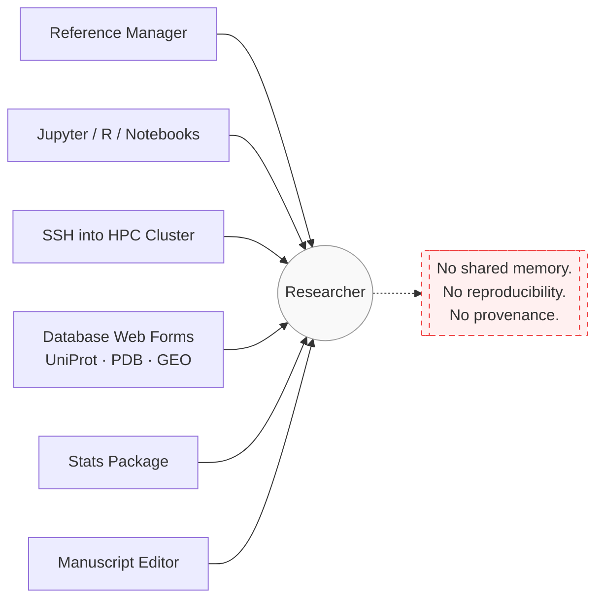
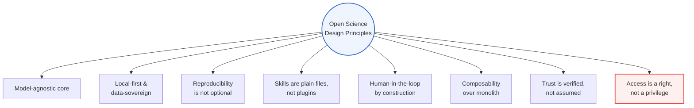
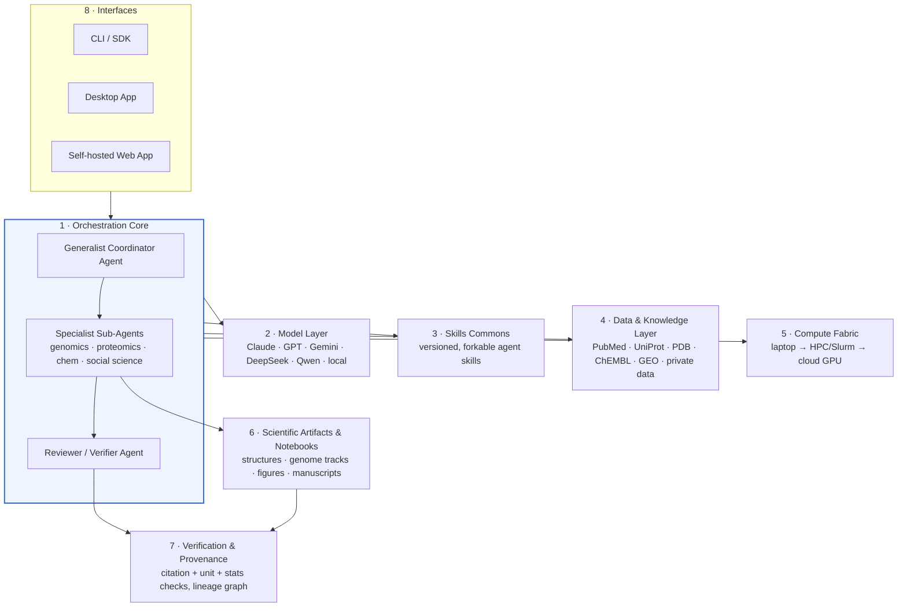
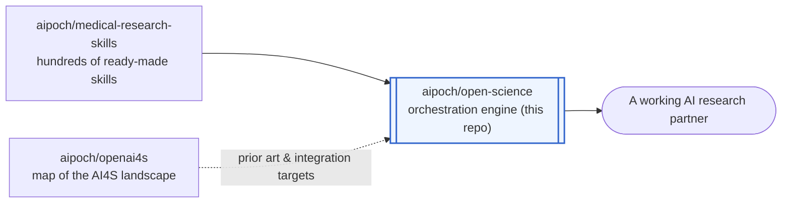
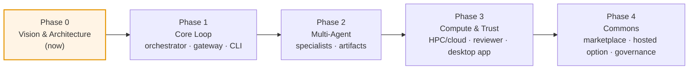

# Open Science

**An open-source, model-agnostic AI workbench for scientific discovery.**

> ### 🔓 Science is not a privilege.
> It shouldn't require a subscription tier, a supported billing region, or one company's approval to put AI to work on real research. Peer review doesn't check your credit card. A hypothesis doesn't care what currency your lab is funded in. Knowledge has always advanced by being shared, checked, and rebuilt in the open — the tools that now sit at the center of that process are the last thing that should be locked behind a paywall. **That belief is the entire reason this project exists**, and it's non-negotiable as the project grows.

**📣 We're building this in public.** Follow the architecture take shape and join the debates as they happen — 🐦 **[@aipoch_ai on X](https://x.com/aipoch_ai)** and 💬 **[our Discord](https://discord.gg/85dKfuGM9)** are where it's actually discussed, before it ever lands in a doc like this one.

> This document is the founding vision for Open Science. There is no working software yet — this is the architecture and philosophy we're recruiting contributors around. If that's the stage you like to join a project at, keep reading.

---

## Table of Contents

- [Why](#why)
- [Open Science vs. Claude Science](#open-science-vs-claude-science)
- [Vision](#vision)
- [Design Principles](#design-principles)
- [What We're Building](#what-were-building)
- [Relationship to the aipoch Ecosystem](#relationship-to-the-aipoch-ecosystem)
- [What This Is Not](#what-this-is-not)
- [Roadmap](#roadmap)
- [Get Involved](#get-involved)
- [License](#license)

---

## Why

A working scientist's day is a tour of a dozen disconnected tools: a reference manager, a Jupyter kernel, an SSH session into a cluster, six browser tabs of database web forms (UniProt, PDB, GEO, ClinVar...), a stats package, and a manuscript editor that knows nothing about any of the above. None of these tools talk to each other. None of them remember what you did yesterday. Reproducing your own analysis from three months ago is often harder than doing it the first time.

Anthropic's [Claude Science](https://www.anthropic.com/news/claude-science-ai-workbench) is the clearest articulation yet of what an AI-native answer to this looks like: a coordinating agent with specialist sub-agents for genomics, proteomics, structural biology and cheminformatics; native rendering of scientific artifacts; a reviewer agent that checks citations and calculations; and direct integration with the databases and compute scientists already use. It's a genuinely good sketch of the destination.

But it is also **closed source** — a single vendor's subscription-gated product: one model family, one company's infrastructure, one roadmap, one pricing policy, one data-handling agreement. A university lab in a country without Anthropic billing, a hospital that legally cannot send patient data to a third-party API, an independent researcher who wants to run everything on a local GPU box, or a team that simply wants to read the code that touches their data — none of them have a seat at that table. You cannot audit what you cannot read, and you cannot fork what was never released.

Science has never worked that way. It advances through open publication, peer review, replication, and the free movement of method and result across borders and budgets — a system built, imperfectly but deliberately, to resist gatekeeping. **Science is not a privilege reserved for whoever can afford the right subscription plan or happens to live in a supported billing region — it is a public good, and the tools that now sit at its center should be held to the same standard the rest of science already is.** A closed-source AI workbench for research recreates exactly the kind of walled garden that scientific norms exist to tear down, no matter how good the product behind the wall is.

We think the software layer that increasingly mediates how science gets done should be inspectable, forkable, and free of a single corporate gatekeeper — the same argument that got Linux under every cloud and JupyterHub under every university. Open Science is an attempt to build that layer from first principles: not a proxy or a jailbreak of someone else's product (see [What This Is Not](#what-this-is-not)), but an independent, open implementation of the same category of tool — open source, because science itself is supposed to be.

> Debating whether this problem framing is even right? That's a Discord conversation, not a GitHub Issue — **[come argue with us](https://discord.gg/85dKfuGM9)**.

## Open Science vs. Claude Science

We keep referencing [Claude Science](https://www.anthropic.com/news/claude-science-ai-workbench) throughout this document because it deserves the credit: it's the best current articulation of "an AI workbench for scientists," and a lot of the architecture below — the coordinator + specialist-agent pattern, a dedicated reviewer agent, artifacts with full reproducibility — is us saluting a good design and asking "what would this look like if it were open?"

So let's be direct about where each project actually stands, instead of hand-waving it:

| | Claude Science | Open Science |
|---|---|---|
| **Source** | Closed source | Open source, Apache-2.0 |
| **Model** | Claude models only | Model-agnostic — Claude, GPT, Gemini, DeepSeek, Qwen, or a local open-weight model |
| **Deployment** | Anthropic-hosted cloud | Self-hosted by default; your infrastructure, your data doesn't have to leave it |
| **Pricing** | Seat-based subscription (Claude Pro/Max/Team/Enterprise) | Free and open; you pay only for the compute/model calls you choose to make |
| **Availability** | Gated by Anthropic billing region and plan tier | Runs anywhere you can run the software |
| **Skills** | ~60 curated skills, Anthropic-maintained | Open skills commons — community-contributed, versioned in git, forkable (seeded by [aipoch/medical-research-skills](https://github.com/aipoch/medical-research-skills)) |
| **Domain scope today** | Life sciences (genomics, proteomics, structural biology, cheminformatics) | Life sciences, plus social science and economics from day one (planned) |
| **Compute** | SSH/HPC access plus Modal for on-demand GPUs | Pluggable compute fabric — any HPC scheduler, any cloud GPU provider (planned) |
| **Reviewer / verification agent** | Yes, shipping today | Yes, planned as an open, inspectable layer ([Phase 3](#roadmap)) |
| **Customization** | Configure agents inside Anthropic's product surface | Every layer — gateway, skill runtime, compute broker, reviewer — is inspectable and replaceable |
| **Maturity** | A shipping, polished product, in use today | Pre-alpha: architecture and vision stage (see [Roadmap](#roadmap)) |

The **Maturity** row matters most, so we won't bury it: **if you need a working AI research assistant today, Claude Science is the more capable choice.** Open Science's advantage isn't feature parity yet — it's the structural ceiling underneath.

But look again at the **Source** and **Availability** rows, because those are the ones we actually care about. Nothing about Claude Science's design requires it to be closed, single-vendor, or subscription-gated; those are business-model choices layered on top of a good architecture, and they're the choices we reject on principle. Closed source turns a research tool into a rented privilege — usable only by whoever holds an active subscription in a supported billing region, inspectable by no one outside the company that built it. That's a normal thing to accept from a consumer product. It's not a normal thing to accept from infrastructure for science, a field whose entire method depends on being able to see how a result was produced. Open Science exists to remove that layer, so the same category of tool can run on a lab's own terms — any model, any infrastructure, any budget, fully auditable, owned by no one but the researcher running it. We'd rather ship a slower, honest path to that than fake a finished product.

## Vision

Our long-run bet: **the AI research assistant becomes infrastructure, not a product.** In the world we're building toward —

- A PhD student with a laptop and an OpenRouter key, a national lab with an air-gapped GPU cluster, and a biotech with an enterprise Claude contract are all running the *same* open orchestration core — they've just pointed it at different models and compute.
- Domain expertise compounds in public. A protocol-design skill written by a genomics lab in Shanghai and a statistics-review skill written by a methodologist in Boston both live in the open skills commons, get used by thousands of other labs, and get better through real usage instead of being reinvented behind each institution's firewall.
- Reproducibility stops being a virtue people feel guilty about skipping. Every figure, every number in a manuscript, carries its lineage — the exact code, environment, and data version that produced it — because the tooling makes that the default output, not extra work.
- No researcher is locked out of AI-augmented science by the country they live in, the model vendor their institution can legally contract with, or their ability to pay a per-seat SaaS fee.

None of this is a technical constraint we're working around — it's the point. Every design decision in this document is downstream of one belief: **science is not a privilege, and the tools built for it shouldn't behave like one.**

We're not trying to out-feature Claude Science. We're trying to make sure the category it defined has an open, self-hostable, vendor-neutral implementation — the way Postgres exists alongside proprietary databases, and Linux exists alongside proprietary operating systems.

## Design Principles

These are the constraints we won't trade away as the project grows:

- **Access is a right, not a privilege.** No plan tier, no billing-region allowlist, no corporate approval queue stands between a researcher and the software. If you can run it, you can use all of it — this is the principle every other one on this list exists to protect.
- **Model-agnostic core.** The orchestrator talks to LLMs through a pluggable gateway. Claude, GPT, Gemini, DeepSeek, Qwen, or a locally-hosted open-weight model behind vLLM/Ollama are all first-class citizens — including using different models for different agents based on cost and capability.
- **Local-first, data-sovereign by default.** Self-hosting is the default deployment target, not an enterprise upsell. Your data, your compute, your keys, unless you explicitly choose a hosted path.
- **Reproducibility is not optional.** Every artifact — figure, table, claim — ships with the code, environment, and data lineage that produced it. This is a property of the system, not a discipline we hope researchers maintain by hand.
- **Skills are plain files, not plugins.** A skill is versioned, human-readable, and forkable (markdown + code, in the spirit of [aipoch/medical-research-skills](https://github.com/aipoch/medical-research-skills)) — auditable by the researcher who's trusting it with their analysis, not a binary blob from a marketplace.
- **Human-in-the-loop by construction.** New data sources, new compute budgets, and new external credentials require explicit approval. Autonomy is opt-in and scoped, never ambient.
- **Composability over monolith.** Small, swappable services (model gateway, skill runtime, compute broker, artifact renderer) instead of one inseparable black box — so labs can replace the parts they don't trust or don't need.
- **Trust is verified, not assumed.** A reviewer/verifier agent checks citations, units, and statistical methods before output ships, and its checks are themselves inspectable.

## What We're Building

Open Science is organized around eight cooperating layers — the same category of capability Claude Science demonstrates, decomposed into open, independently replaceable pieces instead of one closed product surface:

### 1. Orchestration Core
A generalist coordinating agent that plans multi-step research tasks and delegates to specialist sub-agents (genomics, single-cell, proteomics, structural biology, cheminformatics — and, unlike most current tools in this space, non-life-science domains like social science and economics from day one). A dedicated reviewer agent audits the coordinator's output before it reaches the researcher.

### 2. Model Layer
A unified gateway in front of any LLM provider or self-hosted model, with per-agent routing — a cheap fast model for grunt-work sub-tasks, a frontier model for synthesis and writing, a local model for anything that can't leave the building.

### 3. Skills Commons
An open, versioned registry of agent skills — protocol design, statistical review, literature synthesis, figure generation, and domain-specific analysis pipelines — interoperable with [aipoch/medical-research-skills](https://github.com/aipoch/medical-research-skills) as its first and largest skill pack, with a contribution workflow designed so a lab's internal skill can be upstreamed with one PR.

### 4. Data & Knowledge Layer
Pre-built connectors to the open scientific commons — PubMed/PMC, UniProt, PDB, Ensembl, Reactome, ClinVar, ChEMBL, GEO, arXiv/bioRxiv/medRxiv, OpenAlex — plus a connector framework for institutional and proprietary datasets that never leave the researcher's access boundary.

### 5. Compute Fabric
A broker that scales a job from a laptop kernel, to an institutional Slurm/HPC cluster, to on-demand cloud GPUs, with job submission, monitoring, and cost guardrails handled automatically instead of hand-written SSH scripts.

### 6. Scientific Artifacts & Notebooks
Native rendering for the objects science actually produces — 3D protein structures, genome browser tracks, chemical structures, statistical plots — plus reproducible notebook execution and manuscript/figure generation with inline, traceable citations.

### 7. Verification & Provenance Layer
A lineage graph connecting every claim back to the figure, code, and dataset version that generated it, with automated checks for citation accuracy, unit consistency, and statistical-method appropriateness.

### 8. Interfaces
A CLI and SDK for scripting and embedding, a local desktop app for individual researchers and small labs, and an optional self-hosted web app for teams — all talking to the same orchestration core.

## Relationship to the aipoch Ecosystem

This repository is the core engine; it's designed to grow alongside two sibling projects already in the org:

- **[aipoch/medical-research-skills](https://github.com/aipoch/medical-research-skills)** — hundreds of ready-made agent skills for protocol design, data analysis, and academic writing. This is the default skill pack for the life-sciences vertical of Open Science.
- **[aipoch/openai4s](https://github.com/aipoch/openai4s)** — a living index of the open-source AI-for-Science landscape. It's both our map of prior art and a source of components worth integrating rather than reinventing.

Open Science is the piece that was missing: the orchestration layer that actually runs skills against data and compute, rather than a list of skills or a list of related projects.

## What This Is Not

- **Not a proxy or reskin of Anthropic's Claude Science.** Projects like [CSswitch](https://github.com/SuperJJ007/CSswitch) repoint the official Claude Science client at third-party model APIs. That's a clever hack, but it's still Anthropic's client, Anthropic's UX, and Anthropic's constraints underneath. Open Science shares no code with that product — it's an independent implementation of the same problem space, built to be self-hosted and inspected from the ground up.
- **Not tied to any single model vendor.** Anthropic's models are a great option through the gateway, not a dependency.
- **Not a finished product.** As of this writing, this repository documents the architecture and is actively recruiting the contributors who will build it. If you're looking for something you can `pip install` today, this isn't there yet — [openai4s](https://github.com/aipoch/openai4s) is a better place to find working tools in the meantime.

## Roadmap

- **Phase 0 — Vision & Architecture (now).** This document, RFCs for each layer above, and community formation.
- **Phase 1 — Core Loop.** Orchestrator, model gateway, CLI, and a skill runtime compatible with the `aipoch/medical-research-skills` format — enough to run single-agent literature and data-analysis workflows end to end.
- **Phase 2 — Multi-Agent.** Specialist sub-agents, agent hierarchies, reproducible notebook execution, and native artifact rendering.
- **Phase 3 — Compute & Trust.** HPC/cloud compute fabric integration, and an open equivalent of Claude Science's reviewer agent, plus the desktop app.
- **Phase 4 — Commons.** Public skills marketplace, an optional hosted offering, and institutional governance/audit features for labs that need them.

We'll turn each phase into tracked issues and RFCs as contributors join — this roadmap is a starting hypothesis, not a fixed spec. Phase kickoffs and priority calls get announced on **[X](https://x.com/aipoch_ai)** first, and debated in **[Discord](https://discord.gg/85dKfuGM9)** before they get written down here.

## Get Involved

This project is at the stage where architecture decisions are still being made — the best way to have influence is to show up now.

| | |
|---|---|
| 🐦 **X** | Follow **[@aipoch_ai](https://x.com/aipoch_ai)** for build-in-public updates, roadmap calls, and announcements. |
| 💬 **Discord** | **[Join the community](https://discord.gg/85dKfuGM9)** — this is where architecture debates, RFC drafts, and skill-writing happen in real time. |
| 🐛 **Issues** | Open an [Issue](https://github.com/aipoch/open-science/issues) for concrete proposals, especially RFCs for Phase 1 components. |
| 🗣️ **Discussions** | Open a [Discussion](https://github.com/aipoch/open-science/discussions) if you want to propose or debate a piece of the architecture above. |
| 🔭 **Prior art** | Maintain a relevant open-source tool? Check [openai4s](https://github.com/aipoch/openai4s) — integration beats reinvention. |

## License

Apache License 2.0 (proposed — see [LICENSE](LICENSE)).
