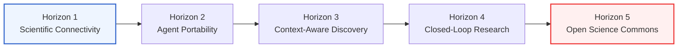
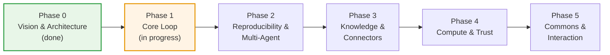

# Open Science Roadmap

> Open Science is building an open, model-agnostic, self-hostable implementation of the "AI research workbench" category — the same category of tool that closed, single-vendor products in this space have demonstrated, decomposed into open, independently replaceable layers. This document is the living map of where that project is headed and how far it has gotten. For the full functional specification behind each item here, see [`docs/PRD.md`](docs/PRD.md).

Status legend: ✅ shipping · 🟡 partially implemented · ⬜ not started

---

## Table of Contents

- [Long-Term Vision: Five Horizons](#long-term-vision-five-horizons)
- [Where We Are Today](#where-we-are-today)
- [Capability Map](#capability-map)
- [Delivery Phases](#delivery-phases)
- [Boundaries & Non-Goals](#boundaries--non-goals)
- [How to Contribute to This Roadmap](#how-to-contribute-to-this-roadmap)

---

## Long-Term Vision: Five Horizons

The delivery phases below are the concrete, near-term execution plan. Underneath them sits a longer arc — five horizons that describe what "done" looks like for AI-native science as a field, not just for this codebase. Each delivery phase is a step along this arc; none of them are meant to be the final state.

1. **Scientific Connectivity.** Ship a foundational access client that registers scientific data sources and life-science tooling as directly callable agent capabilities — turning scattered, siloed scientific databases into infrastructure an agent can reach immediately, instead of a dozen browser tabs a human has to operate by hand.
2. **Agent Portability.** Make scientific intelligence portable across models, frameworks, and research environments, so capability follows the scientist rather than being locked to one vendor's interface. A skill, a workflow, or an analysis a lab builds should keep working when it moves to a different model, a different orchestration framework, or a different institution's infrastructure.
3. **Context-Aware Discovery.** Move from tool *abundance* to tool *intelligence*: an agent facing hundreds of available capabilities should discover, select, and compose only the ones a given task, its evidence, and the surrounding research context actually call for — not enumerate everything it could theoretically use.
4. **Closed-Loop Research.** Connect literature, computation, simulation, notebooks, and verification into a single traceable discovery loop, one where a hypothesis can be generated, challenged, executed, and refined without leaving the loop or losing its provenance at each handoff.
5. **Open Science Commons.** Arrive at a shared intelligence layer for AI-native science — an open infrastructure where protocols, agents, datasets, workflows, and governance live in the open and compose across labs, models, and platforms, so reproducible discovery isn't bottlenecked on any single one of them.

## Where We Are Today

The current codebase is an early, working implementation of the first stretch of Horizon 1 and Horizon 2 — a single-agent desktop workbench with real project/session persistence, a notebook execution kernel, and an artifact library, running today (not "coming soon"). It's honest to describe it as **early alpha**: the core "plan → execute → produce → preview" loop works end to end, but the properties that would make this a genuinely open, science-grade tool — reproducibility guarantees, multi-model routing, a connector ecosystem, remote compute, a skills commons — are mostly still ahead of us.

**Working today:**
- ✅ Agent runtime with a full plan/execute/tool-call loop, wrapped over the Agent Client Protocol (ACP)
- ✅ Electron + React + TypeScript desktop shell with a shadcn-based design system
- ✅ Parallel multi-session workspace with typed tool-activity visualization (diffs, code blocks, web search rows)
- ✅ Project layer with per-project, per-file session storage, migration from the legacy single-file format, and a home page
- ✅ A persistent Python notebook kernel with durable, replayable run history
- ✅ Artifact file storage organized by session / message / run
- ✅ Rich in-app file previews (CSV, FASTA, HTML, image, JSON, Markdown, plain text, notebook cells)
- ✅ Attachment uploads and a permission-approval UI for tool calls

**Not yet built — the hardest, most differentiating work is still ahead:**
- ⬜ A model-agnostic gateway; the runtime today is Claude-specific via ACP, not yet multi-LLM
- ⬜ Artifact versioning and a provenance chain (code + execution log + dependency graph + environment snapshot + conversation context) tied to every output
- ⬜ Additional execution kernels (R, a REPL control plane) and Conda-style environment management
- ⬜ A skills commons and pre-built life-science data connectors
- ⬜ Remote compute (SSH / Slurm / cloud GPU), an async notification bus, and sub-agent fan-out
- ⬜ Network sandboxing, a credential vault, and scoped (single-use / session / project / global) permissions
- ⬜ A reviewer / verifier agent that checks citations, units, and statistical methods before output ships
- ⬜ Spatial annotations, interactive scientific viewers (e.g. molecule/structure editors), and dynamic context compaction

## Capability Map

The product is organized into cooperating layers (see [`docs/PRD.md`](docs/PRD.md) for the full architecture). This table tracks each layer's target capability against what exists in the codebase today.

| Layer | Target capability | Current state | Status |
| --- | --- | --- | --- |
| **Agent Harness & Shell** | Planning/execution/reflection loop, multi-session UI, skill discovery, async notifications | Single-agent loop via ACP, parallel session mounting, typed tool-activity visualization; no skill discovery or notification bus yet | 🟡 |
| **Model Layer** | Pluggable gateway across model vendors and locally-hosted models, per-agent routing | Not implemented; the runtime is wired to one agent backend today | ⬜ |
| **Project & Session Organization** | Durable per-project workspaces, session history, fast resume | Project CRUD, per-project/per-file session storage with migration, home page with recents | ✅ |
| **Multi-Kernel Execution Engine** | Interchangeable Python / R / shell kernels with cross-kernel handoff | One persistent Python kernel with durable run history; no R or REPL control-plane kernel yet | 🟡 |
| **Environment Management** | Create, switch, snapshot, and register reproducible compute environments | Uses a single managed runtime directory; no environment CRUD or snapshotting | ⬜ |
| **Artifacts & Provenance** | Versioned outputs with full lineage (code, logs, dependencies, environment, conversation) | Artifact files saved and organized by session/message/run; no versioning or lineage tracking yet | 🟡 |
| **File Preview & Viewers** | Native, in-app rendering of scientific artifacts | Multi-format renderers (CSV, FASTA, HTML, image, JSON, Markdown, text) plus a project file library and notebook preview | ✅ |
| **Skills Commons** | Versioned, forkable, file-based skills with lexical discovery and explicit loading | Not implemented | ⬜ |
| **Data & MCP Connectors** | Pre-built connectors to open scientific databases, callable from an isolated execution context | Internal MCP infrastructure exists for artifacts/notebook tooling; no external data connectors yet | 🟡 |
| **Remote Compute & Async Tasks** | Job submission to HPC/cloud, async completion notifications, parallel sub-agent fan-out | Not implemented; all execution is local and synchronous today | ⬜ |
| **Security & Permissions** | Scoped permission gates, network allowlisting, directory-level file access control, credential vault | Tool-call permission gate with an approval UI; no scoping tiers, network sandbox, or credential vault | 🟡 |
| **Context Management** | Layered system rules, attachment ingestion, skill-aware context injection, history compaction | File/attachment upload wired into prompts; no automatic skill injection or compaction yet | 🟡 |
| **Interactive Annotations** | Spatially-anchored feedback on images, PDFs, text, and HTML surfaces | Not implemented | ⬜ |

## Delivery Phases

- **Phase 0 — Vision & Architecture (done).** This roadmap, the [PRD](docs/PRD.md), the design system, and initial community formation.
- **Phase 1 — Core Loop (in progress).** Desktop shell, single-agent runtime, project/session persistence, a single execution kernel, artifact storage, and rich in-app previews — all shipping today. Still open in this phase: a model-agnostic gateway, a CLI/SDK entry point, and a file-based skill runtime.
- **Phase 2 — Reproducibility & Multi-Agent.** Artifact versioning with a full provenance chain; additional kernels (R, a REPL control plane) and environment management; specialist sub-agents alongside the generalist coordinator. This is the project's core differentiation from a generic coding agent, and the highest-priority phase for contributors who want to make the biggest structural dent.
- **Phase 3 — Knowledge & Connectors.** A skills commons with versioned, forkable skills and lexical discovery; pre-built connectors to open scientific databases and literature; savable "specialist" roles (instructions + skills + connectors + permissions bundled together).
- **Phase 4 — Compute & Trust.** Remote compute as a first-class primitive (SSH/Slurm/cloud GPU) with async job notifications and sub-agent fan-out; a reviewer/verifier agent; the full security stack (scoped permissions, network allowlisting, directory-level file sandboxing, a credential vault); a pluggable multi-agent-framework backend so the runtime isn't locked to one agent implementation.
- **Phase 5 — Commons & Interaction.** A public skills marketplace, an optional hosted offering, and institutional governance/audit features; spatially-anchored annotations; interactive scientific viewers; dynamic, skill-aware context injection and history compaction.

Phase kickoffs and priority calls get announced on **[X](https://x.com/aipoch_ai)** first and debated in **[Discord](https://discord.gg/85dKfuGM9)** before they land here — this roadmap is a living hypothesis, not a fixed spec, and each phase becomes tracked issues/RFCs as contributors join.

## Boundaries & Non-Goals

Some limits are deliberate, not oversights, and we'd rather say so than let the roadmap imply otherwise:

- **Single-researcher focused.** This is not a real-time, multi-person collaborative editor. Team workflows go through export / share / import, not live co-editing.
- **Computation and outputs, not research semantics.** The system models code, data, and artifacts — it does not bake in "hypothesis / experiment / conclusion" as first-class structured entities.
- **Reproducibility is layered and best-effort.** Provenance capture (Phase 2) targets code, logs, dependencies, and environment snapshots; exact skill-version pinning across time remains a known gap.
- **Does not replace domain-expert judgment.** Statistical validity, batch-effect analysis, and data-leakage risk are still calls a human researcher has to make. Open Science lowers the cost of *executing* and *recording* research, not the cost of *judging* it.
- **Not a proxy or reskin of any closed-source product.** Open Science shares no code with any single vendor's client and is not designed to route around a vendor's billing or terms of service — it's an independent, from-scratch implementation of the same category of tool, built to be self-hosted and inspected from the ground up.

## How to Contribute to This Roadmap

Pick anything marked ⬜ or 🟡 above, open an [Issue](https://github.com/aipoch/open-science/issues) describing your approach, and start a [Discussion](https://github.com/aipoch/open-science/discussions) if you want to debate the design before writing code. See [Get Involved](README.md#get-involved) in the README for the full picture.

---

_This roadmap reflects the current codebase and design docs, and is updated as the project evolves._
