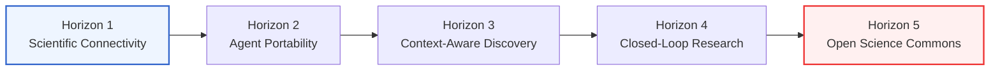
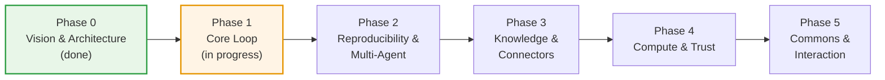

# Open Science Roadmap

> Open Science is building an open, model-agnostic, self-hostable implementation of the "AI research workbench" category — the same category of tool that closed, single-vendor products in this space have demonstrated, decomposed into open, independently replaceable layers. This document is the living map of where that project is headed and how far it has gotten. For the full functional specification behind each item here, see [`docs/PRD.md`](docs/PRD.md).

Status legend: ✅ shipping · 🟡 partially implemented · ⬜ not started

---

## Table of Contents

- [Long-Term Vision: Five Horizons](#long-term-vision-five-horizons)
- [Where We Are Today](#where-we-are-today)
- [Capability Map](#capability-map)
- [Delivery Phases](#delivery-phases)
- [Boundaries & Non-Goals](#boundaries--non-goals)
- [How to Contribute to This Roadmap](#how-to-contribute-to-this-roadmap)

---

## Long-Term Vision: Five Horizons

The delivery phases below are the concrete, near-term execution plan. Underneath them sits a longer arc — five horizons that describe what "done" looks like for AI-native science as a field, not just for this codebase. Each delivery phase is a step along this arc; none of them are meant to be the final state.

1. **Scientific Connectivity.** Ship a foundational access client that registers scientific data sources and life-science tooling as directly callable agent capabilities — turning scattered, siloed scientific databases into infrastructure an agent can reach immediately, instead of a dozen browser tabs a human has to operate by hand.
2. **Agent Portability.** Make scientific intelligence portable across models, frameworks, and research environments, so capability follows the scientist rather than being locked to one vendor's interface. A skill, a workflow, or an analysis a lab builds should keep working when it moves to a different model, a different orchestration framework, or a different institution's infrastructure.
3. **Context-Aware Discovery.** Move from tool *abundance* to tool *intelligence*: an agent facing hundreds of available capabilities should discover, select, and compose only the ones a given task, its evidence, and the surrounding research context actually call for — not enumerate everything it could theoretically use.
4. **Closed-Loop Research.** Connect literature, computation, simulation, notebooks, and verification into a single traceable discovery loop, one where a hypothesis can be generated, challenged, executed, and refined without leaving the loop or losing its provenance at each handoff.
5. **Open Science Commons.** Arrive at a shared intelligence layer for AI-native science — an open infrastructure where protocols, agents, datasets, workflows, and governance live in the open and compose across labs, models, and platforms, so reproducible discovery isn't bottlenecked on any single one of them.

## Where We Are Today

The current codebase is an early, working implementation of the first stretch of Horizon 1 and Horizon 2 — a single-agent desktop workbench with real project/session persistence, a notebook execution kernel, an artifact library, file-based agent skills, and a first set of scientific data connectors, running today (not "coming soon"). It's honest to describe it as an **early preview**: the core "plan → execute → produce → preview" loop works end to end, but the properties that would make this a genuinely open, science-grade tool — reproducibility guarantees, multi-model routing, remote compute, and a public skills commons — are mostly still ahead of us.

**Working today:**
- ✅ Agent runtime with a full plan/execute/tool-call loop, wrapped over the Agent Client Protocol (ACP), on a pluggable agent-framework backend — Claude Code by default, with OpenCode and Codex selectable as alternative implementations behind the same runtime (Codex drives OpenAI Responses providers directly and Chat-Completions providers through a loopback translation gateway, and can authenticate with an existing ChatGPT/Codex subscription login instead of an API key); each backend's app-managed runtime can be installed, switched, and uninstalled from Settings cards
- ✅ Multi-provider model configuration with per-model selection — built-in vendors (Anthropic (Claude), DeepSeek, Zhipu AI (GLM), GLM Coding Plan, Kimi (Moonshot), Kimi For Coding, MiniMax, StepFun, Xiaomi MIMO, SenseNova, Volcengine Ark, and the OpenRouter aggregation gateway) plus custom gateways and Claude / Codex subscription logins (Claude via the `claude setup-token` flow, Codex via the existing ChatGPT/Codex subscription), with live catalog refresh, mid-run switching, per-model multimodal (image-input) capability metadata, and a per-model reasoning-effort control; Anthropic-compatible endpoints on any backend, plus OpenAI-compatible (`/v1/chat/completions`) and Responses (`/v1/responses`) endpoints when an OpenAI-speaking backend is selected
- ✅ An opt-in specialist reviewer that audits a completed turn in a clean, tool-restricted context — tracing the agent's claims against the real transcript, execution log, and artifacts, emitting structured pass/warn/fail findings, and running a bounded, user-abortable fix loop to correct flagged findings
- ✅ Electron + React + TypeScript desktop shell with a shadcn-based design system, a system-tray presence with single-instance locking, and awaited cleanup of agent processes on quit
- ✅ Parallel multi-session workspace with typed tool-activity visualization (diffs, code blocks, web search rows)
- ✅ Project layer with per-project, per-file session storage, migration from the legacy single-file format, and a home page
- ✅ A persistent notebook execution runtime — warm Python, R, and REPL control-plane kernels routed per session binding, with cross-kernel handoff through a shared workspace channel, app-managed conda environments with offline provisioning plus bring-your-own interpreter discovery, and durable, replayable run history with crash-recoverable operation journaling (R is managed-only in this first version)
- ✅ Artifact file storage organized by session / message / run
- ✅ Rich in-app file previews (CSV, FASTA, HTML, image, JSON, Markdown, plain text, notebook cells), with a full-screen preview mode from both the preview panel and the Files tab
- ✅ Attachment uploads and a permission-approval UI for tool calls, with per-conversation approval profiles (remembered by tool category, with per-session grants visible)
- ✅ File-based agent skills — create, edit, and import (zip) skills, pull them into a session through a `/` selector in the composer, with materialized skill directories kept read-only
- ✅ 24 built-in connectors — 23 life-science data connectors expanded and aligned to their upstream MCP servers into 200+ callable tools, plus an offline OpenChemLib molecule viewer — plus custom MCP servers (stdio/HTTP/SSE), callable from agent sessions behind the permission gate
- ✅ Packaged desktop installers for macOS (Apple Silicon + Intel — Developer ID signed and notarized by Apple), Windows, and Linux, plus a nightly build channel off `main`
- ✅ An optional localhost web UI and headless backend mode — serve the same renderer to a browser bound to `127.0.0.1` (with external project/session lifecycle kept in sync and shareable via deep links), run the backend/tray/agent/notebook without an Electron window, and drive that headless service from a bundled `open-science` CLI plus a zero-dependency Node.js task SDK (installable to PATH from the packaged app, no separate Node.js needed) that reuse the same daemon, projects, sessions, credentials, and permissions as the desktop app
- ✅ Remote SSH compute hosts — register a remote machine over SSH as an execution target for notebook runs, alongside the local kernels, so heavier work can run off the laptop
- ✅ Desktop notifications on task completion and failure, so a long-running run doesn't need the window in the foreground to report its outcome
- ✅ Notebook sessions exportable as `.ipynb` — per-tab export plus a download-all, validated against the nbformat spec
- ✅ In-place background auto-update (electron-updater) on macOS, Windows, and Linux, with an About panel and condensed release-note highlights, and a manual-download fallback when auto-update can't complete
- ✅ A configurable data-storage location — relocate large data (artifacts, notebooks, uploads) to another folder with a copy-verify-restart migration, adopt an existing folder, or return to default, plus a legacy-install migration prompt and a missing-root recovery path
- ✅ A read-only session notebook viewer, and ACP reconnect-and-continue (Resume) on an abnormal disconnect
- ✅ A guided first-run onboarding wizard that checks and provisions the runtime environment automatically (app-managed Claude install with no Node/npm required), with background health checks and a recovery path

**Not yet built — the hardest, most differentiating work is still ahead:**
- 🟡 A truly model-agnostic gateway; multi-provider selection ships today (see below), and the OpenCode and Codex backends now reach OpenAI-compatible and Responses endpoints alongside Anthropic-compatible ones — but provider choice is still gated on the selected framework's endpoint compatibility, and unified per-agent routing across arbitrary native protocols is not yet built
- ⬜ Artifact versioning and a provenance chain (code + execution log + dependency graph + environment snapshot + conversation context) tied to every output
- 🟡 Additional execution kernels and reproducible environment management — warm Python/R/REPL kernels with cross-kernel handoff, and app-managed conda environments with offline provisioning, ship today (see above); R is managed-only in this first version, and environment snapshotting/export is not built yet
- ⬜ A public skills commons — versioned, forkable, shareable skills with lexical discovery; local file-based skill management ships today (see above), the shared commons does not
- 🟡 Remote compute and async tasks — remote SSH compute hosts and desktop task-completion/failure notifications ship today (see above); Slurm/cloud-GPU submission and parallel sub-agent fan-out are not built yet
- ⬜ Network sandboxing, a credential vault, and scoped (single-use / session / project / global) permissions
- ⬜ Spatial annotations, interactive scientific viewers (e.g. molecule/structure editors), and dynamic context compaction

## Capability Map

The product is organized into cooperating layers (see [`docs/PRD.md`](docs/PRD.md) for the full architecture). This table tracks each layer's target capability against what exists in the codebase today.

| Layer | Target capability | Current state | Status |
| --- | --- | --- | --- |
| **Agent Harness & Shell** | Planning/execution/reflection loop, multi-session UI, skill discovery, async notifications | Single-agent loop via ACP on a pluggable framework backend (Claude Code default, OpenCode and Codex alternatives), parallel session mounting, typed tool-activity visualization, and desktop notifications on task completion/failure; no skill discovery or async notification bus for fan-out yet | 🟡 |
| **Model Layer** | Pluggable gateway across model vendors and locally-hosted models, per-agent routing | Multi-provider config with per-model selection (built-in vendors — Anthropic (Claude), DeepSeek, Zhipu AI (GLM), GLM Coding Plan, Kimi (Moonshot), Kimi For Coding, MiniMax, StepFun, Xiaomi MIMO, SenseNova, Volcengine Ark, and the OpenRouter aggregation gateway — plus custom gateways and Claude / Codex subscription logins, with per-model multimodal (image-input) capability metadata and a per-model reasoning-effort control; Anthropic-compatible endpoints on any backend and OpenAI-compatible / Responses endpoints via the OpenCode and Codex backends, but provider choice is gated on framework/endpoint compatibility and there is no unified per-agent routing yet | 🟡 |
| **Project & Session Organization** | Durable per-project workspaces, session history, fast resume | Project CRUD, per-project/per-file session storage with migration, home page with recents | ✅ |
| **Multi-Kernel Execution Engine** | Interchangeable Python / R / shell kernels with cross-kernel handoff | Warm Python, R, and REPL control-plane kernels routed per session binding, with cross-kernel handoff through a shared workspace channel, durable run history, and crash-recoverable operation journaling; R is managed-only in this first version | 🟡 |
| **Environment Management** | Create, switch, snapshot, and register reproducible compute environments | App-managed conda environments with version-pinned, SHA256-verified offline provisioning, named-environment create/remove, and bring-your-own interpreter discovery, bound and selected per session; environment snapshotting/export is not built yet | 🟡 |
| **Artifacts & Provenance** | Versioned outputs with full lineage (code, logs, dependencies, environment, conversation) | Artifact files saved and organized by session/message/run; no versioning or lineage tracking yet | 🟡 |
| **File Preview & Viewers** | Native, in-app rendering of scientific artifacts | Multi-format renderers (CSV, FASTA, HTML, image, JSON, Markdown, text), an offline chemical-structure viewer (OpenChemLib, incl. `.rxn` reactions), a project file library, read-only notebook and session-notebook viewers, and a full-screen preview mode | ✅ |
| **Skills Commons** | Versioned, forkable, file-based skills with lexical discovery and explicit loading | File-based skill management (create/edit/import, `/`-selector discovery in the composer, read-only materialized dirs), with per-skill version stamps driving incremental re-materialization; user-facing version pinning and a shared public commons for discovery/reuse are not built yet | 🟡 |
| **Data & MCP Connectors** | Pre-built connectors to open scientific databases, callable from an isolated execution context | 24 built-in connectors — 23 life-science data connectors (literature, genes/proteins, genomes, variants, structures, clinical, chemistry, expression) expanded to 200+ tools aligned with their upstream MCP servers, plus an offline OpenChemLib molecule viewer — plus custom MCP server support (stdio/HTTP/SSE), all callable behind the permission gate | ✅ |
| **Remote Compute & Async Tasks** | Job submission to HPC/cloud, async completion notifications, parallel sub-agent fan-out | Remote SSH compute hosts registrable as notebook execution targets, and desktop notifications on task completion/failure; Slurm/cloud-GPU submission and parallel sub-agent fan-out are not built yet | 🟡 |
| **Security & Permissions** | Scoped permission gates, network allowlisting, directory-level file access control, credential vault | Tool-call permission gate with an approval UI and per-conversation approval profiles (grants remembered by tool category and visible per session), plus an opt-in reviewer that audits a turn's claims against its transcript/logs/artifacts with a bounded fix loop; no network sandbox or credential vault yet | 🟡 |
| **Context Management** | Layered system rules, attachment ingestion, skill-aware context injection, history compaction | File/attachment upload wired into prompts and explicit `/`-selector skill injection; no automatic skill-aware injection or history compaction yet | 🟡 |
| **Interactive Annotations** | Spatially-anchored feedback on images, PDFs, text, and HTML surfaces | Not implemented | ⬜ |

## Delivery Phases

- **Phase 0 — Vision & Architecture (done).** This roadmap, the [PRD](docs/PRD.md), the design system, and initial community formation.
- **Phase 1 — Core Loop (in progress).** Desktop shell, single-agent runtime, project/session persistence, a persistent multi-kernel notebook runtime, artifact storage, rich in-app previews, file-based agent skills, built-in life-science data connectors plus custom MCP servers, packaged installers for macOS/Windows/Linux (macOS signed and notarized) with a configurable data-storage location, a guided first-run onboarding wizard, and in-place background auto-update — all shipping today. Multi-provider model configuration with per-model selection also ships now — across Anthropic-compatible endpoints on any backend, and OpenAI-compatible / Responses endpoints when the OpenCode or Codex agent-framework backend is selected. A first CLI/browser entry point has also landed: an optional localhost web UI (with synced external project/session lifecycle and deep links), a headless backend mode, an `open-science` CLI that runs the backend as a background daemon, and a zero-dependency Node.js task SDK over the same daemon. Still open in this phase: a truly model-agnostic gateway (unified routing across arbitrary native protocols, independent of the selected framework) and a broader scriptable/embeddable SDK surface.
- **Phase 2 — Reproducibility & Multi-Agent.** Artifact versioning with a full provenance chain; additional kernels (R, a REPL control plane) and environment management; specialist sub-agents alongside the generalist coordinator. Two of this phase's execution primitives have already begun landing during Phase 1: warm Python/R/REPL kernels routed per session binding, and app-managed conda environment provisioning with offline bundles and bring-your-own interpreters — so what remains here is artifact versioning/provenance, environment snapshotting/export, and the specialist sub-agents. This is the project's core differentiation from a generic coding agent, and the highest-priority phase for contributors who want to make the biggest structural dent.
- **Phase 3 — Knowledge & Connectors.** A public skills commons with versioned, forkable skills and lexical discovery; savable "specialist" roles (instructions + skills + connectors + permissions bundled together). The connector layer — the built-in life-science connectors plus custom MCP servers — already shipped in Phase 1; what remains in this phase is the shared skills commons and those savable specialist roles.
- **Phase 4 — Compute & Trust.** Remote compute as a first-class primitive (SSH/Slurm/cloud GPU) with async job notifications and sub-agent fan-out; the full security stack (scoped permissions, network allowlisting, directory-level file sandboxing, a credential vault). Several of this phase's primitives have already begun landing in early form during Phase 1: remote SSH compute hosts as notebook execution targets and desktop notifications on task completion/failure (so what remains here on the compute side is Slurm/cloud-GPU submission and sub-agent fan-out); an opt-in reviewer/verifier that audits a turn against its own record with a bounded fix loop; and a pluggable agent-framework backend (Claude Code, OpenCode, and Codex) so the runtime isn't locked to one agent implementation. Deepening these — richer verification rubrics, additional framework backends, and the full security stack — continues here.
- **Phase 5 — Commons & Interaction.** A public skills marketplace, an optional hosted offering, and institutional governance/audit features; spatially-anchored annotations; interactive scientific viewers; dynamic, skill-aware context injection and history compaction.

Phase kickoffs and priority calls get announced on **[X](https://x.com/aipoch_ai)** first and debated in **[Discord](https://discord.gg/85dKfuGM9)** before they land here — this roadmap is a living hypothesis, not a fixed spec, and each phase becomes tracked issues/RFCs as contributors join.

## Boundaries & Non-Goals

Some limits are deliberate, not oversights, and we'd rather say so than let the roadmap imply otherwise:

- **Single-researcher focused.** This is not a real-time, multi-person collaborative editor. Team workflows go through export / share / import, not live co-editing.
- **Computation and outputs, not research semantics.** The system models code, data, and artifacts — it does not bake in "hypothesis / experiment / conclusion" as first-class structured entities.
- **Reproducibility is layered and best-effort.** Provenance capture (Phase 2) targets code, logs, dependencies, and environment snapshots; exact skill-version pinning across time remains a known gap.
- **Does not replace domain-expert judgment.** Statistical validity, batch-effect analysis, and data-leakage risk are still calls a human researcher has to make. Open Science lowers the cost of *executing* and *recording* research, not the cost of *judging* it.
- **Not a proxy or reskin of any closed-source product.** Open Science shares no code with any single vendor's client and is not designed to route around a vendor's billing or terms of service — it's an independent, from-scratch implementation of the same category of tool, built to be self-hosted and inspected from the ground up.

## How to Contribute to This Roadmap

Pick anything marked ⬜ or 🟡 above, open an [Issue](https://github.com/aipoch/open-science/issues) describing your approach, and start a [Discussion](https://github.com/aipoch/open-science/discussions) if you want to debate the design before writing code. See [Get Involved](README.md#get-involved) in the README for the full picture.

---

_This roadmap reflects the current codebase and design docs, and is updated as the project evolves._
