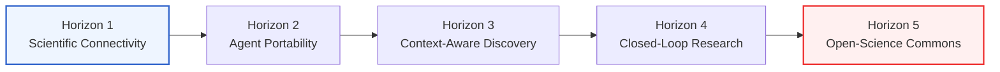
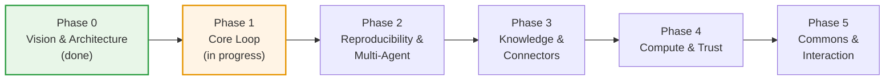

# Open-Science Roadmap

> Open-Science is building an open, model-agnostic, self-hostable implementation of the "AI research workbench" category — the same category of tool that closed, single-vendor products in this space have demonstrated, decomposed into open, independently replaceable layers. This document is the living map of where that project is headed and how far it has gotten. For the full functional specification behind each item here, see [`docs/PRD.md`](docs/PRD.md).

Status legend: ✅ core target is shipping · 🟡 materially incomplete · ⬜ not started. A green capability can continue to improve; it means the target named in that row is available today, not that every longer-term extension is finished.

---

## Table of Contents

- [Long-Term Vision: Five Horizons](#long-term-vision-five-horizons)
- [Where We Are Today](#where-we-are-today)
- [Capability Map](#capability-map)
- [Delivery Phases](#delivery-phases)
- [Boundaries & Non-Goals](#boundaries--non-goals)
- [How to Contribute to This Roadmap](#how-to-contribute-to-this-roadmap)

---

## Long-Term Vision: Five Horizons

The delivery phases below are the concrete, near-term execution plan. Underneath them sits a longer arc — five horizons that describe what "done" looks like for AI-native science as a field, not just for this codebase. Each delivery phase is a step along this arc; none of them are meant to be the final state.

```mermaid
flowchart LR
    H1["Horizon 1<br/>Scientific Connectivity"] --> H2["Horizon 2<br/>Agent Portability"]
    H2 --> H3["Horizon 3<br/>Context-Aware Discovery"]
    H3 --> H4["Horizon 4<br/>Closed-Loop Research"]
    H4 --> H5["Horizon 5<br/>Open-Science Commons"]

    style H1 fill:#eef5ff,stroke:#3366cc,stroke-width:2px
    style H5 fill:#fff0f0,stroke:#e33,stroke-width:2px
```

1. **Scientific Connectivity.** Ship a foundational access client that registers scientific data sources and life-science tooling as directly callable agent capabilities — turning scattered, siloed scientific databases into infrastructure an agent can reach immediately, instead of a dozen browser tabs a human has to operate by hand.
2. **Agent Portability.** Make scientific intelligence portable across models, frameworks, and research environments, so capability follows the scientist rather than being locked to one vendor's interface. A skill, a workflow, or an analysis a lab builds should keep working when it moves to a different model, a different orchestration framework, or a different institution's infrastructure.
3. **Context-Aware Discovery.** Move from tool _abundance_ to tool _intelligence_: an agent facing hundreds of available capabilities should discover, select, and compose only the ones a given task, its evidence, and the surrounding research context actually call for — not enumerate everything it could theoretically use.
4. **Closed-Loop Research.** Connect literature, computation, simulation, notebooks, and verification into a single traceable discovery loop, one where a hypothesis can be generated, challenged, executed, and refined without leaving the loop or losing its provenance at each handoff.
5. **Open-Science Commons.** Arrive at a shared intelligence layer for AI-native science — an open infrastructure where protocols, agents, datasets, workflows, and governance live in the open and compose across labs, models, and platforms, so reproducible discovery isn't bottlenecked on any single one of them.

## Where We Are Today

Open-Science is an **early preview with a working research loop**, not a concept demo. Horizon 1's connectivity foundation is usable today, Horizon 2's portability work is underway across model providers, agent frameworks, skills, and compute environments, and Horizon 4's traceability layer has a concrete foundation in persistent message branches for alternative research paths plus immutable artifact versions tied to inspectable production evidence.

The releases since that foundation filled in the workspace around it: personal specialist agents with scoped capabilities, a signed marketplace, and conversational customization; durable scoped permissions, global proxy settings, and a configurable data-storage location; review-gated session plans, hot-switching of compatible models and providers without reconnecting the agent, and on-demand artifact code reconstruction; a persistent multi-kernel notebook runtime with app-managed environments, remote SSH compute targets, and production subagent delegation; 24 built-in scientific connectors plus custom MCP servers; a localhost-web, headless, CLI, and task-SDK surface with mobile remote access; a token usage dashboard, context-window composition insights, and per-model-call usage details; catalog tags, a redesigned skills experience, and eight interface languages; and, in v0.21.0, CodeBuddy as a fourth app-managed, login-free agent framework, text and image annotations that carry selected context into conversations, expanded OpenCode Go and Zen catalogs, and Windows SSH password authentication for remote compute.

v0.23.0 closes the loop between reading and reasoning: a session reading context links up to three PDFs the agent can read page by page, page through in batches, and search, while text and region selections in the upgraded PDF preview become evidence annotations with click-to-reveal in the source; the notebook gains live kernel variable suggestions in the shared terminal and a docked Variables pane in wide previews; Tencent Coding Plan and Token Plan subscriptions join the built-in providers; and local data gets safer — storage relocation is atomic with artifact metadata and version identity preserved, shared diagnostic reports are redacted, and remote browser sessions, SSH targets, and credential storage are hardened.

v0.24.0 tightens the boundary between notebook code and the network while speeding up everyday navigation: notebook and compute runtimes can only reach Open-Science defaults and domains you approve — out of the box on macOS and Linux, and on Windows once the sandbox's administrator setup is complete — and a blocked destination surfaces an approval in the conversation instead of failing silently; a project quick switcher in the workspace menu lists your other active projects with title and description previews; custom connectors can bind their environment variables, headers, and OAuth sign-ins to device-wide shared credentials instead of storing their own copies; safe default permissions ship seeded, with a restore-defaults action for the baseline; files created or modified by notebook and compute runs are preserved as immutable, checksum-addressed generations so earlier results are never overwritten; German joins the interface languages; and remote compute jobs, the reviewer, and storage and settings handling are hardened throughout.

v0.25.0 makes research outputs editable and tightens runtime control: text artifacts and uploads — Markdown, plain text, scripts, and source code — can be edited as raw text, and every save publishes a new comparable version that preserves its source lineage; NVIDIA Build joins the built-in providers with a curated agent-capable catalog; delegation gets a per-session switch in the composer's agent controls; the project quick switcher gains fuzzy search once the project list grows; app-managed Python and R runtimes can be safely reinstalled from Settings while a global toggle governs whether the agent may create environments, and Settings → Runtimes shows at a glance whether Notebook network protection is active; and multi-version upgrades take one recovery snapshot per batch instead of one per migration step.

v0.26.0 brings HPC-class compute and a literature workspace: remote compute hosts gain a per-host execution mode — direct SSH or Slurm — so notebook runs can submit as Slurm jobs on HPC-partitioned clusters, with durable submission, polling, recovery, cancellation, and cleanup and a Compute Environment Setup skill that hands the cluster's exact setup, repair, and removal steps to the user or administrator; a reference library organizes references, downloaded PDFs, and citations into collections with identifier-aware imports, duplicate comparison and bulk merge, full-text PDF attachment through public open-access sources with parallel multi-source lookup, and citation formatting with provenance; Apodex joins the built-in providers and the latest OpenAI and Anthropic models are selectable out of the box; notebook tool calls render as readable summary cards in messages and approvals; safe default permissions expand to cover routine read-only inspections and approved-plan progress updates; and streaming output, session dispatch, resource bounds, and update handling are smoother throughout.

v0.27.0 scales the literature workspace and lets long work run in the background: the reference library imports many PDFs in one pass with per-file progress, duplicate handling, and retry, shows the active library's total at a glance, and survives data-location relocation; long Notebook, REPL, and shell work runs in the background — releasing the agent turn while keeping exact run identity, cancellation, and provenance, and delivering results automatically across local runs and remote compute jobs; core application skills stay always enabled so built-in entry points never break; the headless CLI and Task SDK gain connector management; and credential storage gains an explicit file mode for headless Linux deployments.

That is an audit milestone, not the finish line for reproducibility. Open-Science can preserve what it can prove about a result and make missing evidence explicit; it cannot yet reconstruct every environment, replay a complete session, or guarantee that rerunning an analysis yields identical output. The roadmap now separates those two promises deliberately:

- **Traceability, shipping:** identify an exact artifact version and inspect its available code, execution, inputs, environment inventory, conversation context, and review evidence.
- **Deterministic reproduction, still open:** restore a portable environment, replay the full producing state, and reconstruct the result with a defined equivalence guarantee.

**Working today:**

- ✅ Agent runtime with a full plan/execute/tool-call loop, wrapped over the Agent Client Protocol (ACP), on a pluggable agent-framework backend — Claude Code by default, with OpenCode, Codex, and a login-free CodeBuddy runtime (driven through an app-owned Chat Completions provider bridge) selectable as alternative implementations behind the same runtime (Codex drives OpenAI Responses providers directly and Chat-Completions providers through a loopback translation gateway, and can authenticate with an existing ChatGPT/Codex subscription login instead of an API key); each backend's app-managed runtime can be installed, switched, and uninstalled from Settings cards; the runtime also supports review-gated session plans — durable, user-reviewable execution contracts that persist across restarts and context compaction, require explicit continuation before an approved unfinished plan can resume, and block turn completion while required steps remain; project-scoped frame reads give the agent access to the live project context
- ✅ Multi-provider model configuration with per-session selection — built-in vendors (OpenAI, Anthropic (Claude), Grok (xAI), DeepSeek, Zhipu AI (GLM), GLM Coding Plan, Kimi (Moonshot), Kimi For Coding, MiniMax, StepFun, StepFun Step Plan, Xiaomi MIMO, SenseNova, Volcengine Ark, Bailian (Alibaba Cloud) with a dedicated Bailian for Plan subscription endpoint, NVIDIA Build with a curated agent-capable catalog, Tencent TokenHub with dedicated Tencent Coding Plan and Token Plan subscriptions, and the OpenRouter aggregation gateway, plus OpenCode Go and OpenCode Zen) plus custom gateways (whose default API format is derived from the active agent framework) and Claude / Codex subscription logins (Claude via shared browser login or an isolated `claude setup-token` flow, Codex via the existing ChatGPT/Codex subscription), with live catalog refresh, mid-run switching that applies compatible model and provider changes to the running session without reconnecting the agent process, per-model multimodal metadata, and a combined composer picker for model and supported reasoning effort; Anthropic-compatible endpoints on any backend, plus OpenAI-compatible (`/v1/chat/completions`) and Responses (`/v1/responses`) endpoints when an OpenAI-speaking backend is selected
- ✅ An opt-in specialist reviewer that audits a completed turn in a clean, tool-restricted context — tracing the agent's claims against the real transcript, execution log, and artifacts, emitting structured pass/warn/fail findings, and running a bounded, user-abortable fix loop to correct flagged findings; a configurable reviewer model policy under Settings that follows the active model or pins a dedicated provider, model, and reasoning effort with an isolated ACP runtime for the complete review chain, durable reviewer assessment snapshots with correction attribution, and bounded evidence reads — paged PDF and Office previews, media-aware artifact reads, and file provenance — whose correction round-trips preserve your responses and the reviewer model identity
- ✅ Personal specialist agent profiles — define reusable agents with their own name, avatar, persona, and scoped capabilities (skills/connectors whitelist or full access), bind one per session so identity applies from the first turn, hot-switch specialists mid-conversation with immediate in-flight-turn handoff behind a reconfigure barrier that fails closed, and manage specialists conversationally through the agent via a name-first control-plane SDK and a `/customize` workflow
- ✅ A shared specialist commons — reusable personal specialist agent profiles with scoped capabilities, portable package import/export, and a signed marketplace with official and user-approved sources ship today; a hosted public discovery commons remains open on the roadmap
- ✅ Electron + React + TypeScript desktop shell with a shadcn-based design system, a system-tray presence with single-instance locking, awaited cleanup of agent processes on quit, a dark-mode theme toggle applied synchronously before first render, and collapsible side panels for flexible workspace layout
- ✅ Parallel multi-session workspace with typed tool-activity visualization (diffs, code blocks, web search rows) grouped under agent-declared purpose titles, editable completed prompts that fork into selectable message branches while preserving the original path, persistent side conversations that run alongside a session's main thread with independent history, generated and editable session details, a unified plan-approval, permission-approval, and ask-user composer lane, a live context-usage indicator with category-level estimates, a token usage dashboard with per-run attribution that includes auxiliary model calls outside the main conversation, branch-aware run trends, and on-demand native context compaction (automatically triggered at 90% for Claude Code and OpenCode, while Codex owns automatic compaction against its configured 95% effective context window; manual compaction is available from the indicator popover; usage persists across restarts), per-turn token usage footers (input, cache, output) under the final agent message, message timing metadata with sent/completed timestamps and elapsed-time plus usage popovers, completed-turn agent framework and model identification, a whole-window find bar (`Cmd/Ctrl+F`), a project-scoped command palette (`Cmd/Ctrl+K`), session keyboard shortcuts, user-waiting message indicators, project actions and agent context, a project quick switcher in the workspace project menu that lists other active projects with title and description previews and fuzzy search once the list grows, refined session sidebar rows with hover previews of session title and description, production subagent delegation with durable messaging and recovery, a per-session delegation switch in the composer's agent controls, smooth live response rendering, a new-conversation keyboard shortcut, a run-marks navigation rail, text, image, and PDF annotations (selected text or regions) that send selected context into the conversation, timeline markers for agent configuration changes between turns, expanded skill-load rows that show the loaded skill document, a session reading context that links up to three PDFs the agent can read page by page, page through, and search across, persistent agent memory that recalls project-scoped knowledge across sessions, a composer message queue with unified draft undo and redo history, branching from completed agent messages, notification attention reasons, and session pinning to keep key sessions at the top of the sidebar
- ✅ Project layer with per-project, per-file session storage, a durable conversation graph that retains branch-specific messages and activity across restarts, generated and editable session details, migration from the legacy single-file format, project pinning on the Home dashboard, and a home page
- ✅ A persistent notebook execution runtime — warm Python, R, and REPL control-plane kernels routed per session binding, plus stateless shell commands executed per call in the session workspace, with cross-kernel handoff through a shared workspace channel, app-managed conda environments with offline provisioning, safe managed-runtime reinstall from Settings, and a global toggle for whether the agent may create runtime environments, plus bring-your-own Python and R interpreter discovery, durable and inspectable run history, a read-only installed-package inventory per runtime environment, a read-only live variable browser for running Python and R kernels, live variable-name suggestions while typing in the shared terminal, and a docked Variables pane beside cells and terminal in wide notebook previews, host capability introspection, notebook artifact read access, outbound network access limited to Open-Science defaults and user-approved domains with in-conversation approval for blocked destinations (enforced out of the box on macOS and Linux; on Windows after the sandbox's administrator setup), with protection status surfaced in Settings → Runtimes, bounded REPL inference for agent-driven evaluation, and crash-recoverable journaling for environment and package mutations
- ✅ Background task execution — run Python, R, persistent REPL, and shell work in the background with durable run identity, bounded concurrency, cancellation, and owned-process recovery, while a delivery ledger joins local runs and remote compute jobs and delivers completed results automatically
- ✅ Immutable, session-scoped artifact versioning with checksummed content, producer code, execution history, exact input references, environment inventory, producing message-branch context, version-scoped reviewer evidence, artifact lineage access, crash recovery, and migration-aware storage validation; files remain indexed across branch switches and evidence that cannot be proven is surfaced as unavailable; files created or modified by notebook and compute runs are preserved as immutable, checksum-addressed generations so earlier results are never overwritten, and allowlisted text artifacts and uploads are editable as raw text, with each save publishing a new comparable version that preserves its source lineage
- ✅ Rich in-app file previews (CSV, FASTA, HTML, PDF with selectable text, area selection, outline and thumbnail navigation, document search, and page navigation, image with zoom and pan including TIFF, JSON, Markdown, plain text, source code with syntax highlighting, notebook cells, and Office documents — DOCX, XLSX, PPTX — rendered in isolated processes), with responsive multi-tab navigation, readable long names, a searchable project file library with grid/list views, a large expand modal, and a split-view preview beside the session, and a full-screen preview mode from both the preview panel and the Files tab, and right-click tab actions
- ✅ Attachment uploads (up to 10 GB per file via streaming upload) with `@path` mentions to grant local folder access, and a permission-approval UI for tool calls, with per-conversation approval profiles (remembered by tool category, with per-session grants visible) and durable scoped permission management (global, project, and session-scoped allow grants with filtering, per-row and family revoke, and an Undo stack), with safe default grants seeded for new installations and a restore-defaults action that re-adds only missing baseline grants
- ✅ File-based agent skills — create, edit, and import (zip) skills, pull them into a session through a `/` selector in the composer, with materialized skill directories kept read-only; let the agent draft and install a new skill from a natural-language description inside the session; import skills already installed in global agent directories with candidate preview; let the agent request a package import from a session attachment or a public GitHub URL behind an app-owned confirmation step; and optionally authenticate GitHub requests with a personal access token for higher rate limits
- ✅ 24 built-in connectors — 23 life-science data connectors expanded and aligned to their upstream MCP servers into 200+ callable tools, plus an offline OpenChemLib molecule viewer — plus custom MCP servers (stdio/HTTP/SSE) that can bind their environment variables, headers, and OAuth sign-ins to device-wide shared credentials, callable from agent sessions behind the permission gate, with runtime status and recovery surfaces
- ✅ Packaged desktop installers for macOS (Apple Silicon + Intel — Developer ID signed and notarized by Apple), Windows, and Linux, plus a nightly build channel off `main`, and German and Spanish interfaces alongside the existing translated languages
- ✅ An optional localhost web UI and headless backend mode — serve the same renderer to a browser bound to `127.0.0.1` (with external project/session lifecycle kept in sync and shareable via deep links), run the backend/tray/agent/notebook without an Electron window, and drive that headless service from a bundled `open-science` CLI plus a zero-dependency Node.js task SDK (installable to PATH from the packaged app, no separate Node.js needed) that reuse the same daemon, projects, sessions, credentials, and permissions as the desktop app; mobile remote access is available through Remote.It pairing with six-digit Open-Science authentication and revocable per-browser trust
- ✅ Remote SSH compute hosts — register a remote machine over SSH (key or OS-encrypted password authentication, including Windows) as an execution target for notebook runs, alongside the local kernels, so heavier work can run off the laptop; harvested results follow the active data-storage location; each host selects a per-host execution mode — direct SSH or Slurm — so notebook runs can also submit as Slurm jobs on HPC-partitioned clusters, with durable submission, polling, recovery, cancellation, and cleanup, and a Compute Environment Setup skill that hands the cluster's exact setup, repair, and removal steps to the user or administrator
- ✅ Desktop notifications on task completion and failure plus durable unread conversation badges and native attention on blocking approval requests, a cross-surface notification message center with a shared inbox, kind- and state-coded icons, durable read state, authorization action state, and structured project/session navigation targets, and live session status with running, waiting-on-you, and newly completed cards on the Home dashboard, so a long-running run doesn't need the window in the foreground to report its outcome
- ✅ Notebook sessions exportable as `.ipynb` — per-tab export plus a download-all, validated against the nbformat spec; whole-conversation export as Markdown and PDF with a normalized public export model, and selective session-artifact downloads with collision-safe batch saving
- ✅ In-place background auto-update (electron-updater) on macOS, Windows, and Linux, with prominent update reminders on project and session surfaces, an About panel and condensed release-note highlights, and a manual-download fallback when auto-update can't complete
- ✅ A configurable data-storage location — relocate large data (artifacts, notebooks, uploads, and notebook workload caches) to another folder with a copy-verify-restart migration that shows the target capacity and estimated copy size, adopt an existing folder, or return to default, plus a legacy-install migration prompt and a missing-root recovery path; global proxy settings with system, manual, and direct modes route Electron and spawned child processes through one app-wide policy
- ✅ A read-only session notebook viewer; ACP reconnect-and-continue (Resume) on an abnormal disconnect that continues an interrupted turn without duplicate messages; and a structured agent clarification workflow that presents multi-question requests as blocking choice cards with previous/next navigation, custom answers, Skip, and Let the agent decide
- ✅ A guided first-run onboarding wizard, split into focused environment, agent, provider, notebook, and location steps, that checks and provisions the runtime environment automatically (app-managed Claude install with no Node/npm required), with background health checks and environment repair moved into Settings, and, on Windows, an automatic suggestion of a suitable secondary data drive for the data location

**Still open — several foundations are already shipping, but these broader targets remain:**

- 🟡 A backend-independent universal model gateway; multi-provider selection ships today (see below), and the OpenCode and Codex backends now reach OpenAI-compatible and Responses endpoints alongside Anthropic-compatible ones — but provider choice is still gated on the selected framework's endpoint compatibility, and unified per-agent routing across arbitrary native protocols is not yet built
- 🟡 Deterministic provenance replay — immutable artifact versions and audit evidence ship today, while portable environment locks, full-fidelity Session replay, and one-click reconstruction remain future work
- 🟡 Reproducible environment portability — managed Python/R environments, named-environment lifecycle, bring-your-own Python/R interpreters, per-session binding, offline provisioning, and immutable environment inventory evidence ship today; portable lock export/restore is not built yet
- ⬜ A public skills commons — versioned, forkable, shareable skills with lexical discovery; local file-based skill management ships today (see above), the shared commons does not
- 🟡 Remote compute and async tasks — remote SSH and Slurm compute hosts, durable background execution with automatic result delivery, desktop task-completion/failure notifications, and production subagent delegation with durable messaging and restart recovery ship today (see above); cloud-GPU submission is not built yet
- 🟡 Security hardening beyond scoped permissions — durable scoped grants, OS-backed encrypted secret storage, workspace containment for app-owned file operations, default-denied Chromium renderer permissions, validated compute IPC arguments, OS-secure-storage-protected persisted compute job execution data, centralized credential management for GitHub tokens, connector keys, and connector sign-ins with health status and guided recovery, and notebook and compute network sandboxing limited to Open-Science defaults and user-approved domains with in-conversation approvals — out of the box on macOS and Linux, after the sandbox's administrator setup on Windows — ship today; user-configurable directory grants and automated credential rotation are not built yet
- 🟡 Spatially-anchored annotations, editable scientific viewers, and automatic skill-aware context discovery — text-selection and point-on-image annotations ship today, and PDF text and region evidence anchors to page coordinates with click-to-reveal; region anchoring on images and HTML surfaces and the remaining targets are not built yet

## Capability Map

The product is organized into cooperating layers (see [`docs/PRD.md`](docs/PRD.md) for the full architecture). This table tracks each layer's target capability against what exists in the codebase today.

| Layer                              | Target capability                                                                                                | Current state                                                                                                                                                                                                                                                                                                                                                                                                                                                                                                                                                                                                                                                                                                                                                                                                                                                                                                                                                                                                                                                                                                                                                                                                                                                                                                                                                                                                                                                                                                                                                                                                                                                                                                                                                                                                                                                                                                                                                                                                                                                                                                                                                                                                                                                                                                                                                                                                                                                                                                                                                                                                                                                                                                              | Status |
| ---------------------------------- | ---------------------------------------------------------------------------------------------------------------- | -------------------------------------------------------------------------------------------------------------------------------------------------------------------------------------------------------------------------------------------------------------------------------------------------------------------------------------------------------------------------------------------------------------------------------------------------------------------------------------------------------------------------------------------------------------------------------------------------------------------------------------------------------------------------------------------------------------------------------------------------------------------------------------------------------------------------------------------------------------------------------------------------------------------------------------------------------------------------------------------------------------------------------------------------------------------------------------------------------------------------------------------------------------------------------------------------------------------------------------------------------------------------------------------------------------------------------------------------------------------------------------------------------------------------------------------------------------------------------------------------------------------------------------------------------------------------------------------------------------------------------------------------------------------------------------------------------------------------------------------------------------------------------------------------------------------------------------------------------------------------------------------------------------------------------------------------------------------------------------------------------------------------------------------------------------------------------------------------------------------------------------------------------------------------------------------------------------------------------------------------------------------------------------------------------------------------------------------------------------------------------------------------------------------------------------------------------------------------------------------------------------------------------------------------------------------------------------------------------------------------------------------------------------------------------------------------------------------------- | ------ |
| **Agent Harness & Shell**          | Planning/execution/reflection loop, multi-session UI, skill discovery, async notifications                       | Agent loop via ACP on a pluggable framework backend (Claude Code default, OpenCode, Codex, and login-free CodeBuddy alternatives), parallel session mounting, selectable message branches, persistent side conversations alongside a session's main thread, a unified plan-approval, permission-approval, and ask-user composer lane, typed tool-activity visualization with per-tool elapsed time, explicit `/` skill discovery, opt-in specialist review, review-gated session plans with durable execution contracts and persistent plan call records, live permission profile changes during a running turn, desktop task-completion/failure notifications, durable unread conversation badges and native attention on blocking approvals, a cross-surface notification message center with kind- and state-coded icons and durable read state, structured agent clarification cards for multi-question requests with per-question answer review, in-app sandboxed previews for source links in agent responses, live session status with running and waiting-on-you cards on the Home dashboard, category-level context-usage estimates with branch-aware run trends and restart persistence, per-turn token usage footers, message timing metadata with elapsed-time and usage popovers, completed-turn agent framework and model identification, native context compaction, personal specialist profiles with scoped capabilities and conversational customization and immediate in-flight handoff, collapsible side panels, a whole-window find bar, a project-scoped command palette, session keyboard shortcuts, user-waiting message indicators, project actions and agent context, refined session sidebar rows with hover previews of session title and description, production subagent delegation with durable messaging and recovery, a per-session delegation switch in the composer's agent controls, smooth live response rendering, a new-conversation keyboard shortcut, a run-marks navigation rail, text, image, and PDF annotations (selected text or regions) that send selected context into the conversation, timeline markers for agent configuration changes, expanded skill-load rows that show the loaded skill document, a session reading context that links up to three PDFs the agent can read page by page, page through, and search across, persistent agent memory that recalls project-scoped knowledge across sessions, a composer message queue, branching from completed agent messages, session references (`#`) in the composer, side-chat advisories injected into a running main turn, session-number lookup in global search, notification attention reasons, and dark mode | ✅     |
| **Model Layer**                    | Pluggable gateway across model vendors and locally-hosted models, per-agent routing                              | Multi-provider config with per-session selection (built-in vendors — OpenAI, Anthropic (Claude), Grok (xAI), DeepSeek, Zhipu AI (GLM), GLM Coding Plan, Kimi (Moonshot), Kimi For Coding, MiniMax, StepFun, StepFun Step Plan, Xiaomi MIMO, SenseNova, Volcengine Ark, Bailian (Alibaba Cloud) with a dedicated Bailian for Plan subscription endpoint, NVIDIA Build with a curated agent-capable catalog, Tencent TokenHub with dedicated Tencent Coding Plan and Token Plan subscriptions, and the OpenRouter aggregation gateway — plus OpenCode Go and OpenCode Zen, custom gateways whose default API format is derived from the active framework and Claude / Codex subscription logins), with per-model multimodal metadata, per-model-call usage details with a per-call context-window chart, a combined model/reasoning-effort composer picker, a consolidated Scenario models card for the subagent, reviewer, and vision policies, and live hot-switching of compatible models and providers without reconnecting the agent process; provider choice is still gated on framework/endpoint compatibility and there is no unified per-agent routing yet                                                                                                                                                                                                                                                                                                                                                                                                                                                                                                                                                                                                                                                                                                                                                                                                                                                                                                                                                                                                                                                                                                                                                                                                                                                                                                                                                                                                                                                                                                                                                          | 🟡     |
| **Project & Session Organization** | Durable per-project workspaces, session history, fast resume                                                     | Project CRUD with per-project/per-file session storage with migration, persistent alternative message branches, a home page with recents and project pinning, whole-conversation export as Markdown and PDF, selective session-artifact downloads, and reversible project and session archiving with undo and confirmed permanent deletion                                                                                                                                                                                                                                                                                                                                                                                                                                                                                                                                                                                                                                                                                                                                                                                                                                                                                                                                                                                                                                                                                                                                                                                                                                                                                                                                                                                                                                                                                                                                                                                                                                                                                                                                                                                                                                                                                                                                                                                                                                                                                                                                                                                                                                                                                                                                                                                 | ✅     |
| **Multi-Kernel Execution Engine**  | Interchangeable Python / R runtimes and shell execution with cross-kernel handoff                                | Warm Python, R, and REPL control-plane kernels routed per session binding, plus stateless shell commands executed per call in the session workspace, with cross-kernel handoff through a shared workspace channel, durable run history, inline image-output previews for captured figures and saved plots from R and Python runs, bounded REPL inference for agent-driven evaluation, package-installation progress with elapsed time, a read-only live variable browser for running kernels, live variable-name suggestions while typing in the shared terminal, progressive history loading for long-running notebooks, and notebook artifact read access; environment and package mutations use crash-recoverable operation journaling                                                                                                                                                                                                                                                                                                                                                                                                                                                                                                                                                                                                                                                                                                                                                                                                                                                                                                                                                                                                                                                                                                                                                                                                                                                                                                                                                                                                                                                                                                                                                                                                                                                                                                                                                                                                                                                                                                                                                                                  | ✅     |
| **Environment Management**         | Create, switch, snapshot, and register reproducible compute environments                                         | App-managed conda environments with version-pinned, SHA256-verified offline provisioning, named-environment create/remove, bring-your-own Python/R interpreter discovery and registration, and per-session binding/selection; provenance records immutable observed inventories, but package management for external R runtimes remains manual and portable lock export/restore is not built yet                                                                                                                                                                                                                                                                                                                                                                                                                                                                                                                                                                                                                                                                                                                                                                                                                                                                                                                                                                                                                                                                                                                                                                                                                                                                                                                                                                                                                                                                                                                                                                                                                                                                                                                                                                                                                                                                                                                                                                                                                                                                                                                                                                                                                                                                                                                           | 🟡     |
| **Artifacts & Provenance**         | Versioned outputs with full lineage (code, logs, dependencies, environment, conversation)                        | Immutable, checksummed, session-scoped artifact versions retain available producer code, execution history, exact input references, environment inventory, producing message-branch context, and version-scoped reviewer evidence, with explicit unavailable states, version navigation, direct links between related evidence, and on-demand LLM-driven code reconstruction from the immutable execution log through an isolated one-shot session, and artifact lineage access for tracing version ancestry                                                                                                                                                                                                                                                                                                                                                                                                                                                                                                                                                                                                                                                                                                                                                                                                                                                                                                                                                                                                                                                                                                                                                                                                                                                                                                                                                                                                                                                                                                                                                                                                                                                                                                                                                                                                                                                                                                                                                                                                                                                                                                                                                                                                               | ✅     |
| **File Preview & Viewers**         | Native, in-app rendering of scientific artifacts                                                                 | Responsive multi-tab renderers for CSV, FASTA, HTML, PDF (selectable text, area selection, outline and thumbnail navigation, document search, and page navigation), images (including TIFF, with zoom and pan), JSON, Markdown, text, source code with syntax highlighting, Office documents, Notebook history, and molecular structures/reactions; includes a project file library, readable long names, isolated Office rendering, split-view preview beside the session, and full-screen preview, with right-click tab actions                                                                                                                                                                                                                                                                                                                                                                                                                                                                                                                                                                                                                                                                                                                                                                                                                                                                                                                                                                                                                                                                                                                                                                                                                                                                                                                                                                                                                                                                                                                                                                                                                                                                                                                                                                                                                                                                                                                                                                                                                                                                                                                                                                                          | ✅     |
| **Skills Commons**                 | Versioned, forkable, file-based skills with lexical discovery and explicit loading                               | File-based skill management (create/edit/import, `/`-selector discovery in the composer, read-only materialized dirs) with a redesigned settings experience — combined agent/specialist filters, actual-user avatar stacks, consolidated row actions, and confirmed bulk deletion for user-installed skills; cross-resource catalog tags with a protected Favorites tag and drag ordering cover skills, connectors, and specialists; per-skill version stamps drive incremental re-materialization; a conversational skill creator that drafts and installs a new skill from a natural-language description inside the session; save-as-skill from a completed conversation turn through the active specialist; direct user skill folder support with out-of-band package validation; bulk enable/disable management with source, status, and text filters; conversational skill imports from public GitHub URLs through an app-owned confirmation step, with optional authenticated access for higher rate limits; provenance-aware figure workflows with registered styling, composition, and paper-narrative helpers on immutable artifact inputs; user-facing version pinning and a shared public commons for discovery/reuse are not built yet                                                                                                                                                                                                                                                                                                                                                                                                                                                                                                                                                                                                                                                                                                                                                                                                                                                                                                                                                                                                                                                                                                                                                                                                                                                                                                                                                                                                                                                                        | 🟡     |
| **Specialist Commons**             | Reusable, forkable specialist profiles that bundle persona, skills, connectors, and permissions                  | Personal specialist agent profiles can be created and reused with a name, avatar, persona, and scoped skills/connectors or full access; one profile can be bound per session and hot-switched with immediate in-flight-turn handoff behind a fail-closed reconfigure barrier; specialists can also be managed conversationally through the agent via a name-first control-plane SDK and a `/customize` workflow; a scoped Specialist marketplace installs signed packages from the official source or user-approved GitHub sources with CDN fallback and skill-conflict resolution, keeping bundled skills and connectors scoped to the selected specialist; browsing separates Installed management from Marketplace discovery with a card-grid layout, filter chips, one primary entry, and an explicit return path; portable package import/export and marketplace installation make specialists shareable across machines, with no platform-bound state                                                                                                                                                                                                                                                                                                                                                                                                                                                                                                                                                                                                                                                                                                                                                                                                                                                                                                                                                                                                                                                                                                                                                                                                                                                                                                                                                                                                                                                                                                                                                                                                                                                                                                                                                                | ✅     |
| **Data & MCP Connectors**          | Pre-built connectors to open scientific databases, callable from an isolated execution context                   | 24 built-in connectors — 23 life-science data connectors (literature, genes/proteins, genomes, variants, structures, clinical, chemistry, expression) expanded to 200+ tools aligned with their upstream MCP servers, plus an offline OpenChemLib molecule viewer — plus custom MCP server support (stdio/HTTP/SSE) with standard remote OAuth sign-in, portable configuration import/export, and standard MCP client-config import/export with credential placeholders, all callable behind the permission gate, with runtime status and recovery surfaces                                                                                                                                                                                                                                                                                                                                                                                                                                                                                                                                                                                                                                                                                                                                                                                                                                                                                                                                                                                                                                                                                                                                                                                                                                                                                                                                                                                                                                                                                                                                                                                                                                                                                                                                                                                                                                                                                                                                                                                                                                                                                                                                                                | ✅     |
| **Remote Compute & Async Tasks**   | Job submission to HPC/cloud, async completion notifications, sub-agent delegation                                | Remote compute hosts registrable as notebook execution targets with key-based or OS-encrypted password authentication (including Windows) and a per-host execution mode (direct SSH or Slurm) with durable Slurm submission, polling, recovery, cancellation, and cleanup, revision-fenced connection leases, session-scoped host discovery with separate enabled and selected execution-target sets controllable from the composer and the CLI/Task API, harvested results routed through the active data-storage location, desktop notifications on task completion/failure, and production subagent delegation with durable messaging and restart recovery; cloud-GPU submission is not built yet                                                                                                                                                                                                                                                                                                                                                                                                                                                                                                                                                                                                                                                                                                                                                                                                                                                                                                                                                                                                                                                                                                                                                                                                                                                                                                                                                                                                                                                                                                                                                                                                                                                                                                                                                                                                                                                                                                                                                                                                                       | 🟡     |
| **Security & Permissions**         | Scoped permission gates, network allowlisting, directory-level file access control, managed credential lifecycle | Tool-call permission gate with an approval UI, per-conversation approval profiles, durable scoped allow grants (global, project, session) with filtering, family revoke, and an Undo stack, live permission profile changes during a running turn, OS-backed encrypted secret storage, workspace containment for app-owned file operations, an opt-in reviewer with a bounded fix loop, centralized credential management for GitHub tokens, connector keys, and connector sign-ins with health status and guided recovery, and notebook and compute network sandboxing limited to user-approved domains with in-conversation approvals (on Windows, after the sandbox's administrator setup); user-configurable directory grants and automated credential rotation remain open                                                                                                                                                                                                                                                                                                                                                                                                                                                                                                                                                                                                                                                                                                                                                                                                                                                                                                                                                                                                                                                                                                                                                                                                                                                                                                                                                                                                                                                                                                                                                                                                                                                                                                                                                                                                                                                                                                                                            | 🟡     |
| **Context Management**             | Layered system rules, attachment ingestion, skill-aware context injection, history compaction                    | Layered application, connector, specialist, and skill guidance; file/attachment upload wired into prompts (with large-file streaming up to 10 GB); explicit `/`-selector skill injection; `@path` mentions to grant local folder access; category-level context-usage estimates; opt-in persistent agent memory recalled across sessions; and native manual and automatic compaction across Claude Code, OpenCode, Codex, and CodeBuddy                                                                                                                                                                                                                                                                                                                                                                                                                                                                                                                                                                                                                                                                                                                                                                                                                                                                                                                                                                                                                                                                                                                                                                                                                                                                                                                                                                                                                                                                                                                                                                                                                                                                                                                                                                                                                                                                                                                                                                                                                                                                                                                                                                                                                                                                                    | ✅     |
| **Interactive Annotations**        | Spatially-anchored feedback on images, PDFs, text, and HTML surfaces                                             | Text-selection and point-on-image annotations ship today across the transcript, tool activity, clarifications, and file previews, persisting across restarts and surviving edit-and-resend, and PDF text and region evidence anchors to normalized page coordinates with click-to-reveal in the source; spatial region/box anchoring on images and HTML surfaces is not built yet                                                                                                                                                                                                                                                                                                                                                                                                                                                                                                                                                                                                                                                                                                                                                                                                                                                                                                                                                                                                                                                                                                                                                                                                                                                                                                                                                                                                                                                                                                                                                                                                                                                                                                                                                                                                                                                                                                                                                                                                                                                                                                                                                                                                                                                                                                                                          | 🟡     |

## Delivery Phases

```mermaid
flowchart LR
    P0["Phase 0<br/>Vision & Architecture<br/>(done)"] --> P1["Phase 1<br/>Core Loop<br/>(in progress)"]
    P1 --> P2["Phase 2<br/>Reproducibility &<br/>Multi-Agent"]
    P2 --> P3["Phase 3<br/>Knowledge &<br/>Connectors"]
    P3 --> P4["Phase 4<br/>Compute & Trust"]
    P4 --> P5["Phase 5<br/>Commons &<br/>Interaction"]

    style P0 fill:#e8f6e8,stroke:#2f9e44,stroke-width:2px
    style P1 fill:#fff4e5,stroke:#e69500,stroke-width:2px
```

- **Phase 0 — Vision & Architecture (done).** This roadmap, the [PRD](docs/PRD.md), the design system, and initial community formation.
- **Phase 1 — Core Loop (in progress).** Desktop shell, single-agent runtime, project/session persistence with editable message branching, a persistent multi-kernel notebook runtime, versioned artifact storage, rich in-app previews, file-based agent skills, built-in life-science data connectors plus custom MCP servers, packaged installers for macOS/Windows/Linux (macOS signed and notarized) with a configurable data-storage location, a guided first-run onboarding wizard, and in-place background auto-update — all shipping today. Multi-provider model configuration with per-session model and reasoning-effort selection also ships now — across Anthropic-compatible endpoints on any backend, and OpenAI-compatible / Responses endpoints when the OpenCode or Codex agent-framework backend is selected. A first CLI/browser entry point has also landed: an optional localhost web UI (with synced external project/session lifecycle and deep links), a headless backend mode, an `open-science` CLI that runs the backend as a background daemon, a zero-dependency Node.js task SDK over the same daemon, and mobile remote access through Remote.It pairing (v0.9.1). Still open in this phase: a backend-independent universal model gateway (unified routing across arbitrary native protocols, independent of the selected framework) and a broader scriptable/embeddable SDK surface.
- **Phase 2 — Reproducibility & Multi-Agent.** The first traceability slice now ships: immutable artifact versions, production evidence, warm Python/R/REPL kernels, and app-managed conda environments. The remaining target is stronger than auditability — deterministic reconstruction, portable environment lock export/restore, full-fidelity session replay, and specialist sub-agents alongside the generalist coordinator. This is the project's core differentiation from a generic coding agent and the highest-priority phase for contributors who want to make the biggest structural dent.
- **Phase 3 — Knowledge & Connectors.** A public skills commons with versioned, forkable skills and lexical discovery; savable "specialist" roles (instructions + skills + connectors + permissions bundled together). The connector layer — the built-in life-science connectors plus custom MCP servers — already shipped in Phase 1, and personal specialist agent profiles with scoped capabilities now ship in v0.9.0 and conversational specialist customization via the agent control-plane SDK in v0.9.1 as the first concrete specialist-role slices; specialist packages are portable across machines with signed marketplace distribution (v0.17.0); opt-in persistent agent memory (v0.22.0) lands here as the first slice of accumulated research knowledge; what remains in this phase is the shared public skills commons.
- **Phase 4 — Compute & Trust.** Remote compute as a first-class primitive (SSH/Slurm/cloud GPU) with async job notifications and sub-agent delegation; the full security stack (scoped permissions, network allowlisting, directory-level file sandboxing, and managed credential lifecycle). Several of this phase's primitives have already begun landing in early form during Phase 1: remote SSH compute hosts as notebook execution targets, desktop notifications on task completion/failure, and production subagent delegation with durable messaging and restart recovery (Slurm execution modes shipped in v0.26.0, so what remains here on the compute side is cloud-GPU submission); an opt-in reviewer/verifier that audits a turn against its own record with a bounded fix loop; a pluggable agent-framework backend (Claude Code, OpenCode, Codex, and CodeBuddy) so the runtime isn't locked to one agent implementation; OS-backed encrypted secret storage; and scoped permission management (global, project, and session-scoped allow grants with filtering, family revoke, and Undo) landing in v0.9.0 as the first concrete trust-stack slice. Deepening these — richer verification rubrics, additional framework backends, and the remaining security stack (user-configurable directory grants and automated credential rotation — centralized credential management shipped in v0.22.0 and notebook and compute network sandboxing in v0.24.0) — continues here.
- **Phase 5 — Commons & Interaction.** A public skills marketplace, an optional hosted offering, and institutional governance/audit features; spatially-anchored region annotations; editable scientific viewers; automatic skill-aware context discovery and injection.

Phase kickoffs and priority calls get announced on **[X](https://x.com/aipoch_ai)** first and debated in **[Discord](https://discord.gg/85dKfuGM9)** before they land here — this roadmap is a living hypothesis, not a fixed spec, and each phase becomes tracked issues/RFCs as contributors join.

## Boundaries & Non-Goals

Some limits are deliberate, not oversights, and we'd rather say so than let the roadmap imply otherwise:

- **Single-researcher focused.** This is not a real-time, multi-person collaborative editor. Team workflows go through export / share / import, not live co-editing.
- **Computation and outputs, not research semantics.** The system models code, data, and artifacts — it does not bake in "hypothesis / experiment / conclusion" as first-class structured entities.
- **Reproducibility is layered and best-effort.** Provenance captures immutable artifact bytes and available code, logs, inputs, environment inventory, message context, and review evidence for audit. Environment inventory is not a solver lock, retained messages omit binary media, and unavailable producer evidence is not inferred. Exact skill-version pinning, portable environment restoration, and full Session replay remain known gaps.
- **Does not replace domain-expert judgment.** Statistical validity, batch-effect analysis, and data-leakage risk are still calls a human researcher has to make. Open-Science lowers the cost of _executing_ and _recording_ research, not the cost of _judging_ it.
- **Not a proxy or reskin of any closed-source product.** Open-Science shares no code with any single vendor's client and is not designed to route around a vendor's billing or terms of service — it's an independent, from-scratch implementation of the same category of tool, built to be self-hosted and inspected from the ground up.

## How to Contribute to This Roadmap

Pick anything marked ⬜ or 🟡 above, open an [Issue](https://github.com/aipoch/open-science/issues) describing your approach, and start a [Discussion](https://github.com/aipoch/open-science/discussions) if you want to debate the design before writing code. See [Get Involved](README.md#get-involved) in the README for the full picture.

---

_This roadmap reflects the current codebase and design docs, and is updated as the project evolves._
