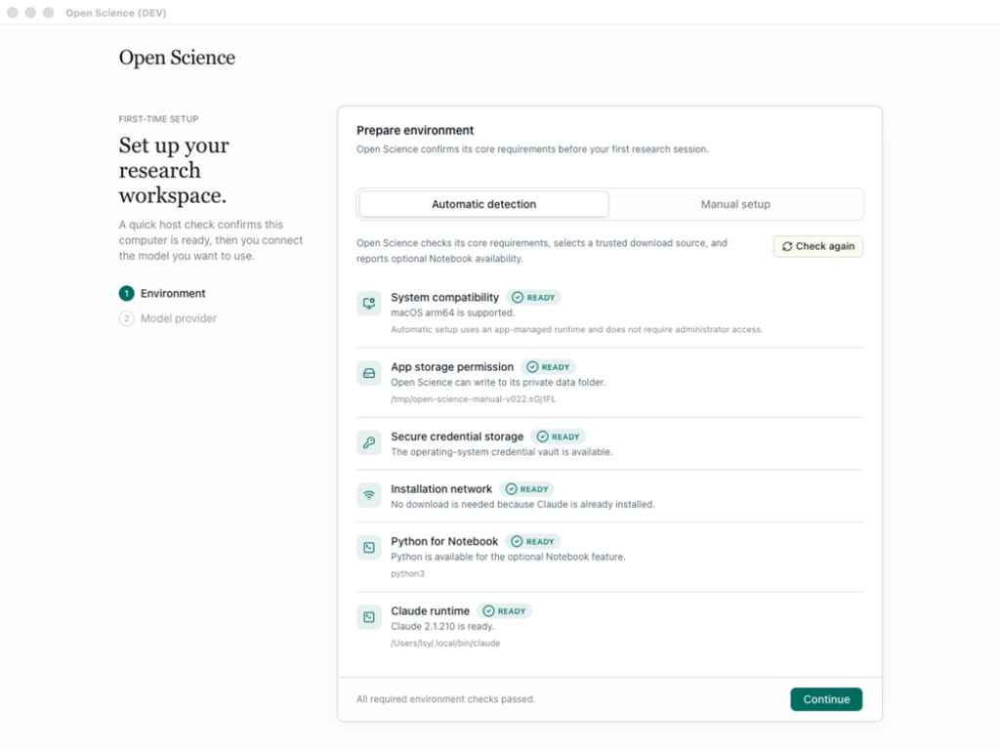
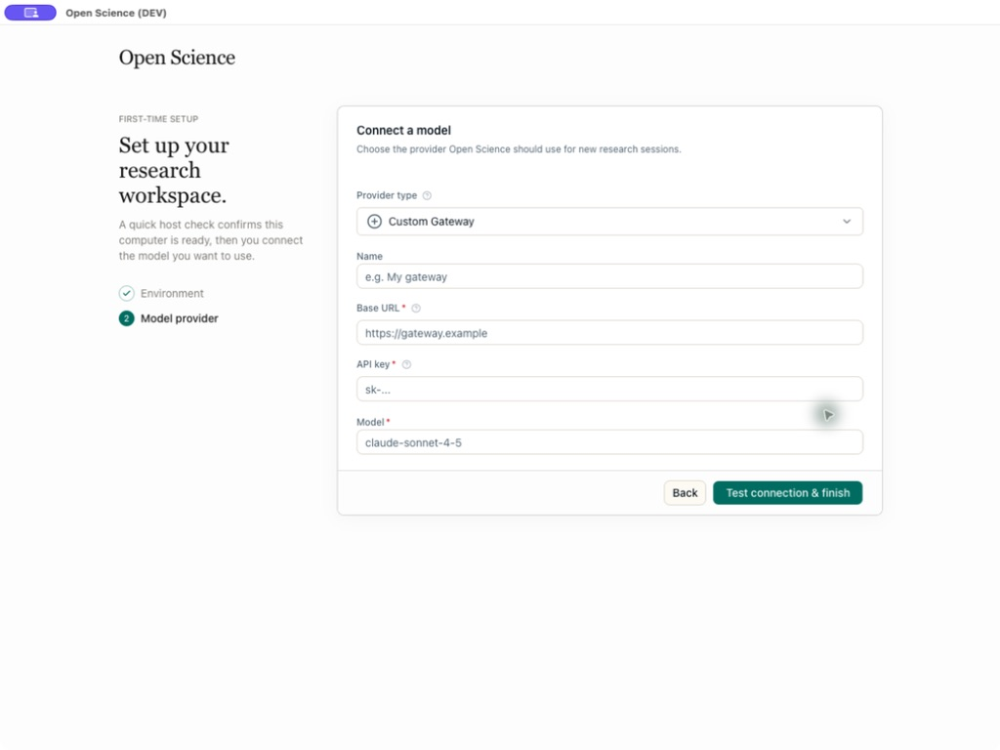

<h1 align="center">AIPOCH Open-Science</h1>

<p align="center">
  Environnement de recherche en IA open source, local et indépendant des modèles, pour une science reproductible.
</p>

<p align="center">
  <a href="https://github.com/aipoch/open-science/releases/latest">
    
  </a>
  <a href="https://github.com/aipoch/open-science/releases/latest">
    
  </a>
  <a href="https://doi.org/10.5281/zenodo.22252246">
    
  </a>
  <a href="https://huggingface.co/datasets/phylobio/BiomniBench-DA">
    
  </a>
  <a href="https://github.com/aipoch/open-science/releases/latest">
    
  </a>
  <a href="../../LICENSE">
    
  </a>
  <a href="https://aipoch.com/open-science">
    
  </a>
  <a href="https://discord.gg/zxQAYjReRv">
    
  </a>
</p>

<p align="center">
  <a href="../../README.md"></a>
  <a href="../zh-Hans/README.md"></a>
  <a href="../zh-Hant/README.md"></a>
  <a href="../ja/README.md"></a>
  <a href="../ko/README.md"></a>
  <a href="../fr/README.md"></a>
  <a href="../ru/README.md"></a>
  <a href="../de/README.md"></a>
  <a href="../es/README.md"></a>
</p>

> Ce document est une traduction de `README.md` en anglais. En cas de divergence, la [version anglaise](../../README.md) fait foi.

AIPOCH Open-Science est un banc de travail de recherche en IA open source, local-first et indépendant des modèles, développé par [AIPOCH](https://aipoch.com/open-science) pour les scientifiques et les chercheurs. Il permet une recherche reproductible et inspectable grâce à des agents IA scientifiques, l'exécution Python et R, des connecteurs de données scientifiques, et une prise en charge multiplateforme de macOS, Windows et Linux. Créez un projet, décrivez votre objectif de recherche en langage naturel, et laissez les agents lire des fichiers, rechercher sur le web, exécuter du code, interroger des sources de données scientifiques, et produire des rapports, des tableaux et des figures avec une provenance traçable — le tout dans un seul espace de travail.

AIPOCH Open-Science prend en charge la recherche computationnelle et intensive en données dans de nombreuses disciplines, notamment l'apprentissage automatique, la statistique, les sciences de la vie, la chimie, la science des matériaux, la physique et les sciences de l'environnement. Il accompagne le processus de recherche, de la revue de littérature et de l'élaboration d'hypothèses jusqu'à l'exécution de code, l'analyse de données, la simulation, la visualisation et la production de résultats de recherche traçables.

> 💡 **[AIPOCH Open-Science v0.27.0 est disponible](https://github.com/aipoch/open-science/releases/latest)** _(dernière mise à jour : septembre 2026)_. AIPOCH Open-Science v0.27.0 étend l'espace de travail dédié à la littérature et laisse les travaux longs s'exécuter en arrière-plan : importez de nombreux PDF en une seule passe avec une progression et une reprise fichier par fichier, exécutez des tâches Notebook et shell en arrière-plan qui livrent leurs résultats automatiquement, et comptez sur un large passage de stabilisation de la littérature couvrant la synchronisation entre clients, le déplacement des données et l'intégrité des imports. Les compétences applicatives principales restent toujours activées, le CLI headless et le Task SDK gagnent la gestion des connecteurs, les diagrammes mermaid s'affichent plus fluidement, et les déploiements Linux headless gagnent un mode explicite de stockage des identifiants sous forme de fichier. Consultez les [notes de version les plus récentes](https://github.com/aipoch/open-science/releases/latest) pour tous les détails.

<p align="center">
 
</p>

## Table des matières

- [Démarrage rapide](#-démarrage-rapide)
- [Visite du produit](#visite-du-produit)
- [Performances aux benchmarks](#performances-aux-benchmarks)
- [Pourquoi AIPOCH Open-Science](#pourquoi-aipoch-open-science)
- [Capacités principales](#capacités-principales)
- [Fournisseurs de modèles](#fournisseurs-de-modèles)
- [Données, autorisations et confiance](#données-autorisations-et-confiance)
- [État du projet](#état-du-projet)
- [Développement et empaquetage](#développement-et-empaquetage)
- [Questions fréquentes](#questions-fréquentes)
- [Participer](#participer)
- [Licence](#licence)

## 🚀 Démarrage rapide

Faites fonctionner AIPOCH Open-Science en trois étapes : téléchargez l'installateur de votre plateforme, terminez le guidage du premier lancement, puis créez un projet de recherche.

### 1. Télécharger l'application

Ouvrez la [dernière version](https://github.com/aipoch/open-science/releases/latest), développez **Assets**, et choisissez l'installateur adapté à votre ordinateur :

| Votre ordinateur                          | Choisissez                               |
| ----------------------------------------- | ---------------------------------------- |
| macOS — Apple Silicon (M1 ou plus récent) | Le DMG macOS pour Apple Silicon / ARM64  |
| macOS — Intel                             | Le DMG macOS pour Intel / x64            |
| Windows x64                               | L'installateur Windows x64               |
| Linux x64                                 | L'AppImage Linux x64 ou le paquet Debian |

Consultez les fichiers et les informations de vérification publiés sur la page de version. Voir [Vérifier votre téléchargement](../../SECURITY.md#verifying-your-download) avant l'installation si vous devez valider un paquet.

> Si macOS ou Windows affiche un avertissement de développeur non identifié ou d'éditeur inconnu, vérifiez que le paquet provient de la page officielle Releases avant de continuer.

Sur macOS, vous pouvez aussi installer l’application avec [Homebrew](https://brew.sh) :

```bash
brew install --cask open-science
```

Homebrew sélectionne automatiquement le paquet Apple Silicon ou Intel.

### 2. Terminer la configuration initiale

Le premier lancement comporte cinq étapes guidées :

1. **Environnement** vérifie la compatibilité, le stockage de l'application, le stockage sécurisé des identifiants et l'accès réseau.
2. **Emplacement des données** choisit où sont stockés les artefacts volumineux, les Notebooks, les téléversements et les environnements.
3. **Environnement d'exécution de l'agent** sélectionne et prépare Claude Code, OpenCode ou Codex. Les environnements d'exécution gérés par l'application peuvent être installés sans Node.js, npm ni mot de passe administrateur.
4. **Fournisseur de modèle** connecte et teste le modèle que vous souhaitez utiliser. Choisissez un fournisseur intégré, une passerelle personnalisée, ou une connexion par abonnement Claude ou Codex existante.
5. **Environnement d'exécution Notebook** prépare éventuellement des environnements Python et R gérés par l'application, ou active des interpréteurs détectés et enregistrés manuellement pour l'une ou l'autre langue.

<table>
  <tr>
    <td width="50%"></td>
    <td width="50%"></td>
  </tr>
  <tr>
    <td align="center"><sub>Vérifications de compatibilité hôte, de stockage et de réseau</sub></td>
    <td align="center"><sub>Validation du fournisseur, de la clé API, du point de terminaison et du modèle</sub></td>
  </tr>
</table>

L'exécution Notebook est optionnelle. Toutes les vérifications d'environnement et de l'environnement d'exécution de l'agent requises doivent réussir avant que `Continue` ne devienne disponible, et la connexion au modèle doit réussir avant la fin de la configuration. Les paramètres Notebook et d'emplacement des données peuvent conserver leurs valeurs par défaut et être modifiés plus tard dans Paramètres.

### 3. Démarrer un projet de recherche

1. Cliquez sur **New project** et donnez au projet un nom de recherche stable, avec une description optionnelle.
2. Ouvrez une session et décrivez l'objectif, les données d'entrée, les contraintes, les sorties souhaitées, et la façon dont le résultat doit être vérifié.
3. Joignez des fichiers source, sélectionnez un modèle vérifié, et choisissez un mode d'approbation.
4. Envoyez la tâche. Inspectez l'activité des outils de l'agent, approuvez les actions sensibles, et ouvrez les artefacts générés dans le panneau d'aperçu.
5. Pour explorer une autre direction, modifiez un message utilisateur antérieur et renvoyez-le sur une nouvelle branche ; utilisez les contrôles de révision du message pour revenir à l'un ou l'autre chemin.
6. Ouvrez la vue **Provenance** d'un artefact pour inspecter ses versions et les preuves disponibles derrière le résultat sélectionné.
7. Poursuivez le travail dans des sessions ultérieures. Utilisez `@` pour référencer un fichier de projet existant et `/` pour sélectionner explicitement une compétence activée.

> Les captures d'écran de ce README illustrent le flux de travail. Les libellés, catalogues et autres détails d'interface peuvent différer de la version que vous installez.

## Visite du produit

### De la demande de recherche au résultat traçable

Prenons une tâche bio-informatique représentative : reproduire une analyse d'expression différentielle publiée, comparer les résultats régénérés à l'article et livrer le rapport, les tableaux et les figures nécessaires à la revue. Les captures ci-dessous sont des vues représentatives de workflows AIPOCH Open-Science documentés ; elles illustrent chaque étape, mais ne proviennent pas d'une même session continue.

#### 1. Définir la tâche de recherche et ses preuves

Décrivez la question de recherche, l'article et les jeux de données sources, les méthodes ou seuils requis, les résultats attendus et les critères d'acceptation. Importez les fichiers utiles ou référencez un artefact existant du projet avec `@`, afin que l'agent parte d'entrées explicites plutôt que d'un contexte caché.

<p align="center">
  
</p>

#### 2. Exécuter avec des outils scientifiques inspectables

L'agent peut associer des compétences scientifiques, des connecteurs de recherche soumis à autorisation, des recherches, des opérations sur les fichiers et du code Python ou R dans le Notebook partagé. Les figures générées peuvent être examinées à côté de la synthèse, tandis que le dossier de l'artefact rend consultables le code producteur capturé et les preuves d'exécution.

<p align="center">
  
</p>

#### 3. Examiner les rapports, tableaux et figures sur place

La réponse finale résume ce qui a été reproduit, les différences observées et les limites importantes. Les rapports Markdown, tableaux CSV, images et autres artefacts de recherche générés restent liés à la session et sont aussi rassemblés dans la bibliothèque de fichiers du projet, où ils peuvent être prévisualisés à côté de la conversation et réutilisés par la suite.

<p align="center">
  
</p>

#### 4. Relier chaque artefact à ses preuves

Chaque artefact généré est stocké dans une version immuable assortie d'une somme de contrôle. La vue **Provenance** peut présenter le code producteur et l'historique d'exécution, les entrées référencées, l'inventaire observé de l'environnement, la branche de conversation productrice et les conclusions du Reviewer propres à la version. Les preuves qui n'ont pas pu être vérifiées sont indiquées comme indisponibles plutôt que déduites.

<p align="center">
  
</p>

## Performances aux benchmarks

### 🏆 N° 1 sur BiomniBench-DA Public 50

AIPOCH Open-Science a obtenu le meilleur score de classement dans la comparaison compilée BiomniBench-DA Public 50, avec **79.05** pour **gpt-5.6-sol (xhigh)**. Ce résultat combine un score du juge Gemini 3.1 Pro de **81.04** et un score du juge DeepSeek v4-pro de **77.06** selon une moyenne à pondération égale, plaçant AIPOCH Open-Science **n° 1** parmi les résultats Public 50 recueillis. Explorez le [jeu de données BiomniBench-DA](https://huggingface.co/datasets/phylobio/BiomniBench-DA).

<p align="center">
  
</p>

## Pourquoi AIPOCH Open-Science

AIPOCH Open-Science réunit les échanges, les Notebooks, les scripts, les bases de données scientifiques, les fichiers et les outils de reporting dans un banc de travail de recherche IA persistant et local-first où l'exécution reste liée aux preuves.

- **Exécution persistante.** Les projets, sessions, fichiers, aperçus et historiques survivent aux redémarrages, tandis que les agents approuvés peuvent exécuter des commandes, Python et R et générer des artefacts.
- **Résultats traçables.** Les versions d'artefacts immuables conservent les preuves de production vérifiables et signalent clairement les éléments indisponibles.
- **Choix indépendant du modèle.** Connectez des fournisseurs cloud intégrés, des passerelles personnalisées compatibles ou des abonnements Claude et Codex, puis choisissez le modèle et l'effort de raisonnement de chaque session.
- **Contrôle local-first.** L'application et l'état du projet restent sur votre ordinateur ; les appels externes utilisent uniquement les services que vous configurez ou approuvez.
- **Ouvert et extensible.** Le code indépendant sous Apache-2.0, les compétences, les connecteurs, l'activité des outils et les fichiers générés sont inspectables, et vous pouvez ajouter des compétences et des connecteurs MCP.

## Capacités principales

AIPOCH Open-Science combine la gestion de projets, l'exécution d'agents multi-modèles, les Notebooks Python et R, les connecteurs de données scientifiques, des versions d'artefacts immuables avec provenance, et un contrôle humain dans la boucle soumis à autorisation, dans un seul espace de travail local. L'application installée et les [notes de version les plus récentes](https://github.com/aipoch/open-science/releases/latest) font foi pour les catalogues évolutifs, les détails d'empaquetage et les options nouvellement ajoutées.

| Domaine                                                             | Capacité principale                                                                                                                                                                                                                                                                                                                                                                                                                                                                                                                                                                                                                                                                                                                                                                                                                                                                                                     |
| ------------------------------------------------------------------- | ----------------------------------------------------------------------------------------------------------------------------------------------------------------------------------------------------------------------------------------------------------------------------------------------------------------------------------------------------------------------------------------------------------------------------------------------------------------------------------------------------------------------------------------------------------------------------------------------------------------------------------------------------------------------------------------------------------------------------------------------------------------------------------------------------------------------------------------------------------------------------------------------------------------------- |
| **Projets et sessions**                                             | Créez et organisez des projets avec des sessions épinglées, des branches de messages et conversations latérales persistantes, et des détails de session modifiables. Modifiez les prompts terminés en branches de messages persistantes et sélectionnables sans supprimer le chemin aval d’origine, puis restaurez les travaux récents, brouillons, historiques de conversation et états d’aperçu.                                                                                                                                                                                                                                                                                                                                                                                                                                                                                                                      |
| **Workflow d’agent**                                                | Les sessions en langage naturel fournissent des réponses en continu et une activité des outils regroupée par objectif, avec contrôles d’approbation et d’arrêt, suivis en file d’attente, compactage du contexte et récupération après redémarrage. Dérivez un travail terminé dans de nouvelles sessions et utilisez des clarifications structurées, des annotations de texte, d’image et de PDF, le contexte de lecture des PDF liés, la mémoire de projet, les références de session et des plans soumis à révision. Les notifications, l’état en direct, les détails de durée et de jetons, la palette de commandes, les aperçus des sources et le changement de projet rendent les recherches longues visibles et maîtrisables.                                                                                                                                                                                    |
| **Modèles et backends d’agents**                                    | Utilisez les fournisseurs cloud intégrés, notamment Apodex, NVIDIA Build avec un catalogue sélectionné de modèles compatibles avec les agents, ainsi que les derniers catalogues de modèles OpenAI et Anthropic (GPT-6 Astra et Claude Fable 5.1), des passerelles personnalisées compatibles ou les connexions par abonnement Claude et Codex. Sélectionnez Claude Code, OpenCode, Codex ou l’environnement CodeBuddy sans connexion comme backend d’agent, avec validation de la compatibilité des modèles et API, entrée d’images multimodale, contrôle du niveau de raisonnement et politiques dédiées au sous-agent, au réviseur et à Vision.                                                                                                                                                                                                                                                                      |
| **Spécialistes et délégation**                                      | Créez des agents spécialistes personnels aux capacités limitées, avec personnalisation conversationnelle, import/export de paquets et transfert immédiat depuis l’agent principal. La place de marché de paquets signés prend en charge les sources GitHub officielles et approuvées par l’utilisateur, les imports tenant compte des conflits et 64 icônes de capacité intégrées ; la délégation en production ajoute une messagerie durable, la récupération et un commutateur de délégation par session.                                                                                                                                                                                                                                                                                                                                                                                                             |
| **Python, R, Notebooks et HPC**                                     | Exécutez des noyaux persistants Python, R et REPL avec des commandes de terminal consignées, dans des environnements hors ligne gérés ou avec vos propres interpréteurs. Travaillez localement ou connectez-vous à des hôtes distants par SSH et soumettez les exécutions de Notebook à des clusters HPC via Slurm ; l’accès réseau protégé, les identifiants chiffrés, l’inspection des paquets et variables, le terminal partagé et l’historique progressif rendent le calcul contrôlable et observable. Les travaux Notebook, REPL et shell de longue durée peuvent s’exécuter en arrière-plan — le tour de l’agent est libéré tandis que l’identité exacte de l’exécution, l’annulation et la provenance sont préservées, et les résultats sont livrés automatiquement, pour les exécutions locales comme pour les tâches de calcul distantes. La gestion des paquets des environnements R externes reste manuelle. |
| **Revue de littérature et gestion des références**                  | Importez des références par DOI, PubMed ID, arXiv ID ou fichier — un seul PDF via l’éditeur de métadonnées, ou plusieurs à la fois avec une progression fichier par fichier, la gestion des doublons et la reprise — et voyez d’un coup d’œil le nombre total de références de la bibliothèque active ; organisez des collections, liez les références aux projets et restaurez les PDF téléchargés depuis la corbeille. Recherchez en parallèle les textes intégraux en libre accès dans Europe PMC, PMC, OpenAlex, arXiv et Unpaywall, fusionnez les doublons sans perdre les pièces jointes ni les liens et formatez les citations à partir des métadonnées enregistrées avec la provenance des artefacts.                                                                                                                                                                                                           |
| **Fichiers scientifiques et aperçus**                               | Joignez des fichiers jusqu’à 10 GB par téléversement en continu, organisez et recherchez une bibliothèque de projet, référencez les téléversements, sorties et dossiers locaux avec `@` et `@path`, puis exportez des fichiers, conversations ou sessions `.ipynb`. Prévisualisez en ligne ou en plein écran des données scientifiques, PDF consultables, fichiers Office, images TIFF et autres, code source, structures et réactions moléculaires et historique de Notebook, avec provenance et navigation vers la source.                                                                                                                                                                                                                                                                                                                                                                                            |
| **Artefacts et provenance**                                         | Conservez des versions immuables d’artefacts propres à chaque session avec contenu contrôlé par somme, code producteur, historique d’exécution, entrées exactes, inventaire d’environnement, contexte de branche de messages, filiation et preuves de révision. À chaque enregistrement, les fichiers Markdown, textes, scripts et codes source modifiables publient une nouvelle version préservant la provenance et comparable à la précédente.                                                                                                                                                                                                                                                                                                                                                                                                                                                                       |
| **Compétences scientifiques et connecteurs de données**             | Étendez les workflows de recherche avec **22 compétences intégrées mises en avant** et **24 connecteurs de recherche intégrés**. Créez des compétences par conversation ou à partir d’un travail terminé, importez des paquets et sources GitHub et ajoutez des connecteurs MCP locaux ou distants personnalisés avec autorisations par outil et import/export de configuration. Les compétences applicatives principales restent toujours activées afin que les points d’entrée intégrés continuent de fonctionner, et le CLI headless et le Task SDK peuvent lister, inspecter, activer ou désactiver des connecteurs. Des étiquettes transversales, une étiquette Favoris protégée et des filtres consultables organisent compétences, connecteurs et spécialistes.                                                                                                                                                  |
| **Données locales, confidentialité, autorisations et vérification** | Conservez localement les données de projet, l’état de l’application et les caches de Notebook dans un stockage configurable et migrable ; utilisez les modes proxy système, manuel ou direct et un tableau de bord des jetons avec carte thermique d’activité sur 30 jours et attribution par exécution. Contrôlez les actions avec `Ask for approval`, `Auto-approve edits` ou `Full access`, des autorisations limitées, des identifiants centralisés (avec un mode de stockage fichier explicite pour les déploiements Linux headless), des domaines de calcul approuvés par l’utilisateur et des politiques par connecteur et outil. Un réviseur facultatif audite les transcriptions, journaux d’exécution et artefacts, signale les résultats réussite/avertissement/échec et peut exécuter une boucle de correction limitée avec preuves durables.                                                               |

## Fournisseurs de modèles

AIPOCH Open-Science est agnostique vis-à-vis des modèles au niveau produit : connectez-le à de grands fournisseurs LLM cloud, à une passerelle personnalisée, ou réutilisez un abonnement Claude ou Codex existant. La disponibilité des fournisseurs dépend actuellement du backend d'agent sélectionné et des protocoles d'API qu'il prend en charge. Il y a quatre façons de connecter un modèle :

| Mode de fournisseur             | Fonctionnement                                                                                                                                                                                                                                                                                                                                                                                |
| ------------------------------- | --------------------------------------------------------------------------------------------------------------------------------------------------------------------------------------------------------------------------------------------------------------------------------------------------------------------------------------------------------------------------------------------- |
| **Fournisseurs cloud intégrés** | Choisissez dans la liste des fournisseurs affichée par l'application installée et authentifiez-vous avec la clé demandée.                                                                                                                                                                                                                                                                     |
| **Passerelle personnalisée**    | Fournissez une URL de base compatible, une clé API et l'identifiant exact du modèle. Le format d'API par défaut (Messages, Chat Completions ou Responses) est dérivé du framework d'agents actif, si bien qu'une nouvelle passerelle personnalisée est compatible d'emblée.                                                                                                                   |
| **Abonnement Codex**            | Sélectionnez le framework d'agents Codex, puis choisissez Abonnement Codex comme type de fournisseur.                                                                                                                                                                                                                                                                                         |
| **Abonnement Claude**           | Connectez-vous avec un abonnement Claude selon deux modes : **partagé** (une connexion navigateur qui stocke les identifiants dans votre profil `~/.claude` par défaut) ou **isolé** (un `claude setup-token` géré par l'application sous un `CLAUDE_CONFIG_DIR` appartenant à l'application, entièrement isolé de `~/.claude/`, avec un flux navigateur plus un repli par collage de jeton). |

Le fournisseur héritage **Local Claude** a été retiré. Les entrées Local Claude précédemment stockées
sont abandonnées lors de la mise à niveau ; ajoutez **Claude Subscription** et authentifiez-vous avec
la connexion navigateur partagée ou le flux isolé `claude setup-token` à la place.

Les fournisseurs cloud intégrés incluent actuellement OpenAI, Anthropic, Grok (xAI), DeepSeek, Zhipu AI (GLM) avec un point de terminaison dédié GLM Coding Plan, Kimi (Moonshot), MiniMax, StepFun avec un point de terminaison d'abonnement Step Plan dédié, Xiaomi MIMO, SenseNova, Volcengine Ark, Bailian (Alibaba Cloud) avec un point de terminaison d'abonnement Bailian for Plan dédié, Tencent TokenHub plus des points de terminaison d'abonnement dédiés Tencent Coding Plan et Token Plan, et la passerelle d'agrégation OpenRouter, parmi d'autres ; certains sont spécifiques à une région.

Les fournisseurs, les modèles disponibles et les points de terminaison régionaux peuvent évoluer indépendamment de ce README. Considérez le sélecteur de fournisseur et le test de connexion de l'application installée comme la source de vérité.

## Données, autorisations et confiance

AIPOCH Open-Science stocke les données de projet, les paramètres, les versions d'artefacts et les preuves de provenance sur l'ordinateur local. Les clés API sont conservées localement et utilisent le stockage sécurisé d'identifiants du système d'exploitation lorsqu'il est disponible. Les journaux sont locaux et ne sont pas téléversés automatiquement.

Un flux de données externe reste possible et doit être examiné :

- Les requêtes de modèle envoient l'invite et le contexte nécessaire au fournisseur de modèle sélectionné.
- Les recherches web et les connecteurs distants envoient leurs paramètres affichés à des services externes.
- Les connecteurs locaux peuvent exécuter des commandes de confiance sur l'ordinateur.
- Les pièces jointes, les références `@`, les journaux et les rapports générés peuvent contenir des données de recherche sensibles.

Choisissez le profil d'autorisation le plus étroit qui convienne à la tâche :

| Mode                 | Comportement                                                                                                                 | Usage recommandé                                                          |
| -------------------- | ---------------------------------------------------------------------------------------------------------------------------- | ------------------------------------------------------------------------- |
| `Ask for approval`   | Demande avant les modifications, commandes, réseau et appels de connecteurs                                                  | Nouveaux flux, données sensibles, scripts peu familiers                   |
| `Auto-approve edits` | Autorise automatiquement les modifications de l'espace de travail ; demande pour les commandes, le réseau et les connecteurs | Travail d'édition de fichiers de confiance avec un accès externe contrôlé |
| `Full access`        | Autorise automatiquement les modifications, commandes, réseau et connecteurs                                                 | Travail clairement délimité, pleinement de confiance, sans surveillance   |

Examinez les paramètres des connecteurs et l'activité des outils avant de les approuver. N'incluez jamais de clés API, de jetons d'accès, d'identifiants patients, de données non publiées ou de chemins locaux sensibles dans des captures d'écran ou des journaux d'issues publiques.

## État du projet

AIPOCH Open-Science est une application de bureau en développement actif, disponible pour macOS, Windows et Linux. Le développement se concentre sur des flux de recherche local-first fiables, des capacités scientifiques extensibles, des artefacts de recherche traçables, et une exécution contrôlée par l'utilisateur.

Consultez la [dernière version](https://github.com/aipoch/open-science/releases/latest) pour les téléchargements courants et les changements spécifiques à une version. Pour les capacités livrées, partielles et prévues, voir la [carte des capacités](../../ROADMAP.md#capability-map).

AIPOCH Open-Science assiste l'exécution de la recherche et la tenue des registres ; les chercheurs restent responsables des méthodes, de l'interprétation, de la confidentialité et de la validité scientifique.

## Développement et empaquetage

AIPOCH Open-Science est une application Electron construite avec React, TypeScript, Prisma/SQLite, et un environnement d'exécution d'agent basé sur ACP.

Prérequis pour le développement à partir des sources :

- Node.js 22 (voir [`.nvmrc`](../../.nvmrc)), avec npm
- Git
- Python 3 uniquement si vous voulez l'exécution Notebook

```bash
git clone https://github.com/aipoch/open-science.git
cd open-science
npm install
npm run dev
```

`npm install` génère automatiquement le client Prisma et installe les dépendances natives Electron. `npm run dev` construit les bundles Electron main/preload, démarre le renderer, et ouvre l'application de bureau. Les données de développement sont isolées sous `~/.open-science-project`.

Commandes utiles :

| Commande               | Objet                                             |
| ---------------------- | ------------------------------------------------- |
| `npm run dev`          | Démarrer l'application de développement           |
| `npm run dev:web`      | Application de dev + UI web localhost (127.0.0.1) |
| `npm run dev:headless` | Backend de dev + UI web, sans fenêtre Electron    |
| `npm run lint`         | Exécuter ESLint                                   |
| `npm run typecheck`    | Vérifier les types du code main et renderer       |
| `npm test`             | Exécuter la suite Vitest                          |
| `npm run build`        | Vérifier les types et construire l'application    |
| `npm run build:web`    | Construire l'UI web localhost optionnelle         |
| `npm run build:mac`    | Empaqueter les builds macOS                       |
| `npm run build:win`    | Empaqueter les builds Windows                     |
| `npm run build:linux`  | Empaqueter les builds Linux                       |

La sortie empaquetée est écrite sous `dist/`.

### Modes web localhost et headless

Le backend de bureau peut éventuellement servir le même renderer à un navigateur sur l'ordinateur local. Cette
fonctionnalité est désactivée par défaut et ne se lie qu'à `127.0.0.1`.

```bash
npm run build:web
npm run dev:web
```

Ouvrez l'URL authentifiée affichée par l'application. Utilisez `npm run dev:headless` pour démarrer le
backend, la barre d'état, l'environnement d'exécution de l'agent et le service web localhost sans ouvrir de fenêtre Electron.
Définissez `OPEN_SCIENCE_WEB_PORT` pour choisir un port (par défaut `44100`). Quitter explicitement
l'application arrête toujours normalement les processus d'agent et Notebook.

### Accès distant mobile

La même UI web localhost peut être atteinte depuis un téléphone ou une tablette via l'appariement Remote.It. Appariez
un navigateur avec un code AIPOCH Open-Science à six chiffres, approuvez-le une fois sur le bureau, et l'espace de travail
reste joignable sans exposer directement le serveur en boucle locale. La confiance du navigateur est révocable, et
les changements de mode ou l'arrêt du service invalident immédiatement les sessions distantes actives.

### CLI et SDK headless

Le CLI headless et le SDK Node.js sans dépendance utilisent le même démon local, les mêmes projets, sessions,
identifiants et autorisations que les interfaces de bureau et web. L'usage détaillé vit avec le
paquet publiable, afin qu'il n'y ait qu'une seule référence de commandes à maintenir :

- [Guide CLI](../../packages/open-science/CLI.md) - installation, cycle de vie du service, automatisation des tâches,
  artefacts, formats de sortie et codes de sortie
- [Aperçu du paquet SDK](../../packages/open-science/README.md) - démarrage rapide Node.js et point d'entrée du paquet

## Questions fréquentes

### Qu'est-ce qu'AIPOCH Open-Science et qui le développe ?

R : AIPOCH Open-Science est un environnement de travail de recherche indépendant et open source (Apache-2.0), développé par l'équipe AIPOCH. **AIPOCH Open-Science** est le nom complet du produit, tandis que **Open-Science** est son nom abrégé. Les deux noms désignent le même produit AIPOCH.

### Que dois-je faire la première fois que j'ouvre AIPOCH Open-Science ?

R : Terminez les cinq étapes de configuration : **Environment**, **Data location**, **Agent runtime**, **Model provider** et **Notebook runtime**. Corrigez les lignes requises marquées `Action needed`, installez ou réparez l'agent sélectionné s'il est proposé, et testez la connexion au modèle. La configuration Notebook et un emplacement de données personnalisé sont optionnels.

### Qu'est-ce qu'une clé API, et où l'obtenir ?

R : Une clé API est un identifiant secret émis par un fournisseur de modèle. Créez-en une ou copiez-la depuis la console développeur/API de ce fournisseur. Le fournisseur peut facturer les requêtes faites avec la clé. Traitez-la comme un mot de passe : ne la partagez jamais et ne la commitez jamais dans un dépôt.

### Ai-je besoin d'une clé API ?

R : Non si vous réutilisez une connexion par abonnement existante — un abonnement Claude via la connexion navigateur partagée ou un flux `claude setup-token` isolé géré par l'application, ou une connexion d'abonnement ChatGPT/Codex sur le backend Codex. Les fournisseurs cloud intégrés et les passerelles personnalisées exigent leurs propres clés.

### Quels fournisseurs de modèles puis-je utiliser ?

R : Ouvrez le sélecteur de fournisseur pendant la configuration ou sous `Settings → Model` pour les choix pris en charge par votre application installée et le backend d'agent sélectionné. Vous pouvez utiliser un fournisseur cloud intégré, une passerelle personnalisée compatible, un abonnement Claude via une connexion partagée ou isolée, ou un abonnement Codex sur le backend Codex.

### Pourquoi le test de connexion au modèle échoue-t-il ?

R : Vérifiez la clé API pour des caractères manquants ou des espaces, confirmez l'URL de base et la région, utilisez l'identifiant de modèle exact du fournisseur, et confirmez l'accès réseau et le solde du compte. Pour un abonnement Claude, réessayez la connexion navigateur partagée ou actualisez l'identifiant isolé `claude setup-token`, selon le mode sélectionné.

### Pourquoi `Continue` est-il désactivé pendant la configuration ?

R : L'étape courante n'a pas satisfait sa condition requise. Corrigez toute ligne d'environnement marquée `Action needed`, installez ou réparez l'environnement d'exécution de l'agent sélectionné, ou validez le fournisseur de modèle, selon l'étape active. La configuration Notebook est optionnelle et n'affecte que l'exécution Notebook.

### La configuration est terminée. Comment démarrer une tâche de recherche ?

R : Créez ou ouvrez un projet, démarrez une session, joignez les fichiers source éventuels, et décrivez l'objectif, les contraintes, la sortie attendue et les critères de validation. Utilisez `@` pour référencer un fichier de projet et `/` pour sélectionner une compétence activée.

### Comment exécuter des travaux sur un cluster HPC distant ?

R : Activez la compétence **Remote Compute (SSH)** sous **Settings → Skills**, enregistrez votre cluster sous **Settings → Compute**, puis démarrez une session et sélectionnez la compétence avec `/remote-compute-ssh`. La compétence gère l'enregistrement de l'hôte, les commandes courtes via SSH, et la soumission de travaux pleinement asynchrone — l'application démarre automatiquement un tour d'analyse lorsque le travail se termine, si bien que vous n'écrivez jamais de boucle d'attente.

### Y a-t-il une interface en ligne de commande ?

R : Oui. Installez-la en un clic depuis **Settings → General → Command line tool → Install command** (ajoute `open-science` à votre PATH ; aucun Node.js séparé n'est nécessaire). Le CLI contrôle le service local et soumet des tâches de recherche sans ouvrir de navigateur :

```bash
# Démarrer le service en arrière-plan
open-science start --no-open

# Créer un projet et exécuter une tâche par son nom exact
open-science project create "Systematic review"
open-science run --project "Systematic review" \
  --prompt-file ./task.md \
  --approval-profile auto \
  --skill literature-review \
  --wait --json

# Télécharger un artefact généré
open-science artifacts list <session-id> --json
open-science artifacts download <artifact-id> --output ./report.md
```

Voir le [guide CLI](../../packages/open-science/CLI.md) pour la référence complète des commandes, les formats de sortie JSON/JSONL, les codes de sortie, et les options de service headless.

### Comment inspecter l'origine d'un résultat généré ?

R : Ouvrez l'artefact généré et choisissez **Provenance**. Sélectionnez une version pour inspecter l'identité du contenu et, lorsqu'ils sont disponibles, le code producteur, l'historique d'exécution, les entrées, l'inventaire d'environnement, le contexte de conversation productrice, et les preuves du relecteur. Les preuves qu'AIPOCH Open-Science n'a pas pu vérifier sont marquées indisponibles.

### Puis-je réviser une demande antérieure sans perdre la conversation qui a suivi ?

R : Oui. Modifiez un message utilisateur terminé et renvoyez-le pour créer une nouvelle branche à partir de ce point. Les tours ultérieurs d'origine restent disponibles, et les flèches de révision à côté du message basculent entre les chemins alternatifs.

### Mes données de recherche restent-elles sur mon ordinateur ?

R : Les projets, sessions, fichiers, paramètres et identifiants configurés sont stockés localement par défaut. Le contenu nécessaire aux requêtes de modèle, aux recherches web ou aux appels de connecteurs peut tout de même être envoyé au service externe que vous avez sélectionné ; examinez donc les entrées sensibles et les politiques du fournisseur avant d'exécuter une tâche.

## Participer

AIPOCH Open-Science accueille les signalements de bogues, les propositions de fonctionnalités, les discussions de conception, les questions de la communauté et les contributions via GitHub, Discord, X et le site web d'AIPOCH. Choisissez le canal qui correspond le mieux à votre objectif, puis consultez le guide de contribution et les précautions relatives aux publications publiques avant de partager les détails de votre projet.

| Canal                                                                    | Utilisez-le pour                                                                                   |
| ------------------------------------------------------------------------ | -------------------------------------------------------------------------------------------------- |
| [GitHub Issues](https://github.com/aipoch/open-science/issues)           | Bogues, échecs reproductibles et propositions de fonctionnalités concrètes                         |
| [GitHub Discussions](https://github.com/aipoch/open-science/discussions) | Questions de conception, propositions de feuille de route et conversations techniques plus longues |
| [Discord](https://discord.gg/zxQAYjReRv)                                 | Aide communautaire, coordination des contributeurs et discussion informelle                        |
| [X / @aipoch_ai](https://x.com/aipoch_ai)                                | Annonces de version et mises à jour de construction en public                                      |
| [Site officiel d'AIPOCH Open-Science](https://aipoch.com/open-science)   | Présentation officielle du produit et téléchargements                                              |

Avant d'ouvrir une issue publique, retirez des journaux et captures d'écran les clés API, jetons, chemins de fichiers privés, données non publiées, identifiants patients et autres éléments sensibles. Voir [CONTRIBUTING.md](CONTRIBUTING.md) pour le flux de développement.

> ⭐ **Ajouter une étoile au dépôt :** Si ce projet vous a été utile, une étoile sur GitHub serait grandement appréciée. Étoiler le dépôt encourage le développement continu. Cela ne prend qu'une seconde, mais cela a un impact réel sur le projet.

## Licence

Licence Apache 2.0 — voir [LICENSE](../../LICENSE).
